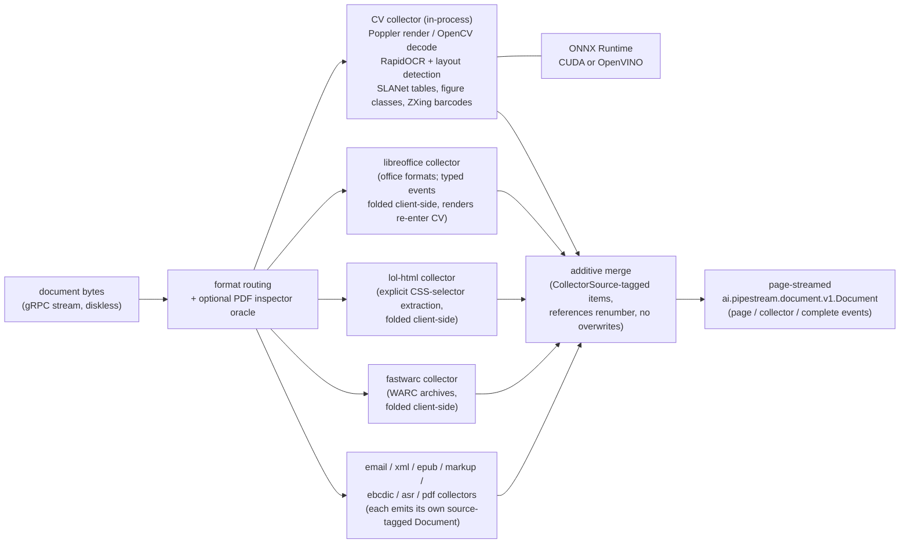
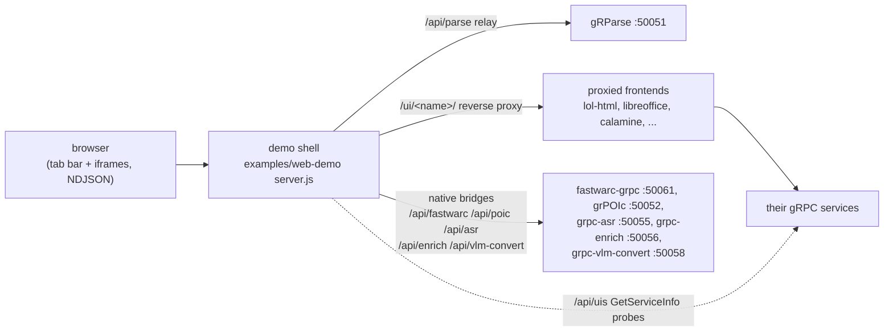
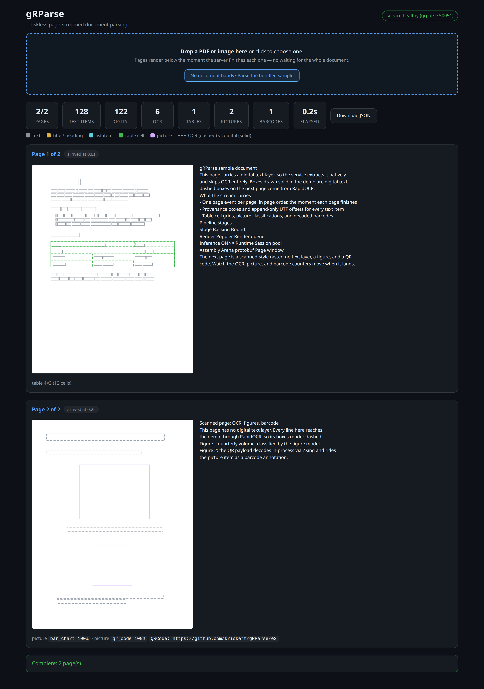

# gRParse

C++ gRPC document parse service: **diskless PDF/image to page-streamed protobuf** with boxes and stable offsets. RapidOCR and document layout detection run through **ONNX Runtime** on NVIDIA GPUs (CUDA) or Intel GPUs (OpenVINO). Layout labels, reading order, table items with model or geometry cell grids, picture items, and figure classification are live.

- Architecture (runtime split, anti-seesaw pipeline, offset contract): [docs/ARCHITECTURE.md](docs/ARCHITECTURE.md)
- Collector strategy (gRPC-first fleet, coordination, stream joining): [docs/COLLECTORS.md](docs/COLLECTORS.md)
- Epics & tasks (C++ vs Java ownership, milestones): [docs/EPICS.md](docs/EPICS.md)

**Speed thesis:** pipelined pages, warm ORT session pools, selective OCR, and early page emission keep CPU and GPU busy.

gRParse turns PDF pages and raster images into text with the maintained C++ [RapidOcrOnnx](https://github.com/RapidAI/RapidOcrOnnx) implementation. It targets NVIDIA CUDA through ONNX Runtime. The host was detected with an NVIDIA GeForce RTX 4080 SUPER; the included container exposes it with Compose's `gpus: all` setting.

## Architecture

The parse pipeline: document bytes stream in over gRPC (nothing touches
disk), route by format — with grpc-pdf-inspector as an optional routing
oracle for PDFs — into one or more collectors, and every collector's output
merges additively into one page-streamed `Document`:



The demo shell (`examples/web-demo`) fronts the whole grpc-services family:
registered frontends proxy under `/ui/<name>/`, and headless services get
native tabs bridged in the shell's own server:



## Run

1. Download the model files listed in [models/README.md](models/README.md).
2. Build and start the service:

   ```bash
   docker compose up --build
   ```

The service listens on `localhost:50051` and implements `ai.pipestream.parse.v1.ParseService` from the local `parse.proto` contract. `ConvertSource` currently accepts one `FileSource` containing base64-encoded PDF, PNG, JPEG, or TIFF bytes. It renders every `OutputFormat` the wire declares from the merged document: TEXT, MARKDOWN, HTML, HTML_SPLIT_PAGE, JSON, YAML, DOCTAGS, DOCLANG, and VTT (an empty `to_formats` keeps the plain-text default alone), and returns `INVALID_ARGUMENT`, naming the offender, for populated options it does not implement and for unrenderable format values.

Each PDF request opens a small pool of Poppler documents directly from the request bytes, so render and digital-text extraction for different pages of the same document proceed in parallel. Recognition is selective by default: full native-text pages skip raster OCR, while weak/partial digital layers keep their native boxes and still run OCR, and geometry merge drops overlapping OCR duplicates so headers and scan body can coexist. Two `ConvertDocumentOptions` fields override the default per request: `do_ocr = false` disables recognition entirely, so only the embedded text layer is read and a page with no text layer yields no text; `force_ocr = true` recognizes every page at full-page scope and the recognized text replaces the embedded layer. `do_ocr = false` with `force_ocr = true` is contradictory and rejected by name. Pages rasterize at 200 DPI by default; `render_scale` sets a per-request scale in multiples of 72 DPI (accepted range [1.0, 8.0], rejected outside it by name), and all digital-line geometry scales with it so downstream boxes stay consistent. Raster inputs decode with OpenCV from request memory and are already pixels, so they ignore `render_scale`. Nothing is written to disk on the hot path.

`ConvertSource` returns the contract's `ConvertDocumentResponse`, populated with a native `Document`. Each OCR line becomes a `TextItem`, with its page and bounding box in `provenance`; pages, `TableItem`/`PictureItem` entries from layout, and the `#/body` reference graph are also populated. It deliberately leaves asynchronous jobs and remote sources unimplemented.

### Chunking

`ChunkHierarchicalSource` and `ChunkHybridSource` parse the source exactly the way `ConvertSource` does and chunk the document that comes out of it. Their asynchronous and watch variants stay unimplemented.

Determinism is the point: the same input bytes produce the same chunk bytes on every machine and every run. There is no tokenizer download, no locale, and no defaulted budget, and every boundary rule is versioned. Each chunk carries the version it was produced under in `rules_digest`:

| Rule set | Digest | What it decides |
|---|---|---|
| hierarchical walk | `grparse-hier/1` | one chunk per item or list group in body-tree order, with the heading trail in force |
| hybrid | `grparse-hybrid/1;tok=wordish/1;sent=sentence/1;max_tokens=N;merge_peers=B` | the walk, then peer merging under the budget, then a sentence-wise split |
| tokenizer | `wordish/1` | one token per run of alphanumeric code points, per CJK or kana code point, and per punctuation or symbol code point |
| sentences | `sentence/1` | a boundary after `.`, `!`, `?`, or `…` plus any closing quotes, when whitespace or the end follows; no abbreviation handling by design |

`ChunkHybridSource` requires `max_tokens` and returns `INVALID_ARGUMENT` naming the field when it is absent; an explicit `tokenizer` must be `wordish/1`. Both RPCs accept `use_markdown_tables` (pipe tables instead of the default `rowLabel, colLabel = value` flattening) and `include_raw_text`. `include_converted_doc` returns the parsed document alongside the chunks.

A chunk reports `start_offset` and `end_offset` as UTF-8 code point positions in the document's concatenated body text whenever the parse supplied an offset table for every text item the chunk consumed; otherwise both stay unset rather than being guessed.

The `Health` RPC reports readiness. The server intentionally fails at startup if a required model is absent or the OCR sessions cannot initialize on the configured provider, instead of silently running CPU OCR. The optional layout, table, and figure models are the one exception: a provider that will not build one of those graphs costs that model its acceleration, not the whole server, and the session is rebuilt on CPU with the provider's own error logged. The `GetServiceInfo` RPC reports the service name, build version, and the shared-shell UI advertisement (`UiInfo`: tab title, mount path, tooltip).

To stream a PDF with the supplied client, start the service and run:

```bash
docker compose up -d
./scripts/parse_pdf.sh /path/to/document.pdf
```

The helper invokes the compiled bidirectional-streaming client. It reads the
source and sends fixed-size chunks directly to gRPC; it does not base64-encode
the document or create temporary files.

### Result targets

`ConvertSource` takes an optional `Target` naming where the result goes besides the response body. Targets are additive delivery, never a replacement: a response that carries a `target_result` still carries its full `DocumentResponse`.

| Target | What it does |
|---|---|
| `inbody` (or unset) | the default: the response body alone |
| `zip` | returns the result bundle as a ZIP in `TargetResult.archive` |
| `s3` | writes the same bundle to an S3-compatible store and returns one `StoredObject` (key, ETag, size) per member |
| `put`, `presigned_url` | `UNIMPLEMENTED`, named in the status message |

The bundle is one canonical file set, identical whichever target delivers it:

| Member | Contents |
|---|---|
| `manifest.json` | every other member with its SHA-256 and byte size, plus the generator and schema version |
| `document.pb` | the `Document`, deterministically serialized |
| `document.json` | the canonical JSON dialect of the same document |
| `exports/<name>.<ext>` | one file per output format the request asked for |
| `pages/page_NNNN.png` | each page image the document embeds |
| `pictures/pic_NNNN.png` | each picture image the document embeds |

Determinism is the point here too: members are sorted by path, archive timestamps are fixed at the MS-DOS epoch, the compressor is held to one setting, and the manifest carries no whitespace, no clock, and sorted keys. The same document and the same requested formats produce a byte-identical archive on every machine and every run.

`S3Target` signs each PUT with AWS Signature V4 over libcurl; path style, no SDK, no ambient credential chain. The credentials come only from the request, are never logged, and never appear in an error message. `endpoint` may name any S3-compatible store (with or without a scheme, defaulting to https), and the region is read from the endpoint host or defaults to `us-east-1`. TLS peer and hostname verification is ON unless the request explicitly sets `verify_ssl: false` for a self-signed internal store; an absent field means verify. Uploads run on their own pool, sized by `GRPARSE_UPLOAD_WORKERS` (default 4) and `GRPARSE_UPLOAD_QUEUE` (default 32). A store that refuses an upload does not cost the caller the conversion: the response keeps its full `DocumentResponse`, the failure lands as an error item, and the status reports partial success; only a misconfigured target itself (missing bucket, unusable endpoint) fails the RPC, as `INVALID_ARGUMENT`.

Security posture: the target's endpoint and credentials are caller-supplied, which makes `ConvertSource` an egress writer to wherever the caller points it. That is the intended shape for the trusted-internal deployments this server assumes (the same trust the request's source URLs already get); an internet-facing deployment must put an endpoint policy in front of this RPC or keep the target surface disabled.

### Examples: browser demo and other-language clients

[`examples/`](examples/README.md) holds working consumers of the streaming
contract: a browser demo that paints each page event live (boxes, reading-order
text, tables, picture classes, barcodes) plus terminal clients in Python and
Go. The demo runs with the service in one command:

```bash
docker compose --profile demo up --build   # service on :50051, demo on :8080
```

The page ships a bundled two-page sample (digital text + table on page 1, a
scanned-style OCR page with a classified figure and a decodable QR code on
page 2), so one click exercises every feature with no document at hand, and
the full parse result downloads as JSON when the stream completes:



### Runtime image

The runtime stage is minimal-base compatible: it runs no package manager and
no ldconfig, ships its complete non-CUDA shared-library closure from the
build stage (cuDNN included), runs as the numeric non-root user 65532, and
asks the base only for glibc and the CUDA runtime libraries. The default base
is `nvidia/cuda:13.3.0-runtime-ubuntu26.04`; a hardened base such as a Docker
Hardened Images `nvidia-cuda` mirror drops in without a Dockerfile change:

```bash
docker build --build-arg GRPARSE_RUNTIME_IMAGE=docker.io/<org>/dhi-nvidia-cuda:<tag> .
```

The tag's CUDA major version must match the build stage (CUDA 13) and its
glibc must be at least ubuntu26.04's. The compose file runs the container
read-only with a tmpfs `/tmp`, all capabilities dropped, and privilege
escalation disabled.

## Page-streaming OCR

`ai.pipestream.parse.v1.ParseStreamingService/StreamProcessDocument` accepts a
stream of `DocumentChunk` messages. Send the same `document_id`, filename, and
content type with the chunks, then set `complete = true` on the last one. The
server accepts PDFs and single raster images, up to 500 MiB. The chunk fields
`do_ocr`, `force_ocr`, and `render_scale` carry the same recognition mode and
rasterization scale as the unary options, each resolved from the first chunk
that sets it (the same doctrine as `collectors`); an invalid value fails the
stream with `INVALID_ARGUMENT` naming the offender.

It emits one `DocumentStreamEvent.page` per page in page-number order, followed by one
`DocumentStreamEvent.complete`. A page event contains the supplied
`PageItem` and the page's supplied `BaseTextItem` records. `TextOffset` carries
append-only UTF offsets, source type, and OCR confidence when available. The original
`Document` shape is unchanged: this is only a transport envelope for
incremental delivery.

Each outbound event and its nested protobuf messages are allocated in a
short-lived `google::protobuf::Arena`. The arena stays alive until the
asynchronous gRPC write completes. Protobuf Arena does not own Poppler, OpenCV, or ONNX Runtime buffers;
those libraries release their own in-memory buffers at the page boundary. The
server never writes input documents, rendered pages, OCR intermediates, or
results to disk. It only reads the installed binaries and OCR model files. The
server has globally bounded document, render, inference, and assembly queues.
RapidOCR inference workers never perform gRPC writes. A stream that does not
consume events stops returning page credits to the scheduler, so that document
cannot advance beyond its configured page window. Other admitted documents can
continue through the global queues, and a stalled document keeps its scheduler
state until the client's credits return or the stream ends. The reactor's
in-flight write buffer is sized from `GRPARSE_PAGE_WINDOW`, so raising the page
window raises both bounds together.

The server has two CUDA RapidOCR sessions by default. Tune concurrency and
queue memory with `GRPARSE_PAGE_WORKERS`, `GRPARSE_RENDER_WORKERS`,
`GRPARSE_ASSEMBLY_WORKERS`, `GRPARSE_DOCUMENT_QUEUE`, `GRPARSE_RENDER_QUEUE`,
`GRPARSE_INFERENCE_QUEUE`, `GRPARSE_ASSEMBLY_QUEUE`, `GRPARSE_PAGE_WINDOW`,
`GRPARSE_PDF_PARSERS`, and `GRPARSE_MAX_ACTIVE_DOCUMENTS`.
`GRPARSE_PDF_PARSERS` sets how many Poppler documents a single PDF request may
open concurrently; it defaults to `GRPARSE_RENDER_WORKERS` and costs one parsed
document structure per slot. `GRPARSE_INTRA_OP_THREADS` caps how many threads
one pooled ONNX Runtime session uses inside a single operator; it defaults to
cores divided by `GRPARSE_PAGE_WORKERS`, because ONNX Runtime's own default is
every core per session and a pool of those is oversubscribed by exactly the
worker count - on a small machine that costs more than the extra worker earns.
The shared layout session is exempt and takes all cores, since there is only
one of it. Select the NVIDIA device with
`GRPARSE_CUDA_DEVICE`. `GRPARSE_ORT_EP` picks the ONNX Runtime execution
provider: `cuda` (default, fails startup if CUDA cannot initialize),
`openvino` (Intel GPU/CPU/NPU through the OpenVINO build — see below), `cpu`
(explicit CPU inference), or `auto` (prefers CUDA, then OpenVINO, then CPU,
logging each fallback). Requesting a provider the linked ONNX Runtime does not
offer fails with the list that is actually available. An OCR session that
throws during inference is destroyed and rebuilt on next use instead of
staying in the pool poisoned. Optional RapidOCR detect knobs:
`GRPARSE_OCR_PADDING`, `GRPARSE_OCR_MAX_SIDE`, `GRPARSE_OCR_BOX_SCORE`,
`GRPARSE_OCR_BOX_THRESH`, `GRPARSE_OCR_UNCLIP`. These are read and range-checked
once at startup: a malformed or out-of-range value fails the server immediately
rather than being silently ignored per page. gRPC memory, thread,
and stream limits use `GRPARSE_GRPC_MEMORY_MIB`, `GRPARSE_GRPC_MAX_THREADS`,
and `GRPARSE_MAX_CONCURRENT_STREAMS`.

Every RPC is served on gRPC's callback API. A unary conversion blocks for as
long as the document takes, so it never runs on the thread that reacted to the
call: it is handed to a pool sized by `GRPARSE_UNARY_WORKERS` (default 16) and
finished from there, which is what keeps a slow parse from pinning an
event-manager thread. `GRPARSE_UNARY_QUEUE` (default 64) bounds the conversions
waiting for a free worker; past it a conversion is refused with
`RESOURCE_EXHAUSTED` rather than queued behind its own deadline. A worker
spends nearly all its life waiting on the page scheduler or on a collector, so
both numbers bound concurrent conversions rather than CPU use.

When the layout model is present (see
[models/README.md](models/README.md)), every page also runs layout detection
on the configured execution provider. `GRPARSE_LAYOUT_MODEL=heron|picodet`
picks the detector: `heron` (the default, `models/layout_heron.onnx`) predicts
seventeen labels, `picodet` (`models/layout_publaynet.onnx`) the legacy five.
Both decoders are compiled in; the choice is made once at startup.

Text lines inside a labelled region take that region's label, so headings,
list items, captions, footnotes, formulas, code, document indexes,
checkboxes, forms, and key-value regions all reach the `Document` with their
own `DocItemLabel` instead of collapsing into plain text. Running headers and
footers land on the furniture content layer under `#/furniture` rather than
in the body. Table and picture regions are additionally emitted as
`TableItem`/`PictureItem` entries with provenance boxes so downstream table
and picture extraction have crops to work from.

Text streams in reading order: a recursive XY-cut over layout regions (or the
lines themselves when no model is present) splits pages at the widest
whitespace gap, so multi-column pages read column by column instead of
interleaving rows, and UTF offsets follow that order. Control layout with
`GRPARSE_LAYOUT=auto|on|off` (`auto`, the default, enables layout when the
selected model's file exists and says so at startup; `on` fails startup if it
is missing). Full-digital pages are still rasterized when layout is active,
but continue to skip OCR.

The layout model loads once into a single ONNX Runtime session that every
inference worker shares, rather than one session per worker: `Run` is
thread-safe and the decoders hold no state between calls, so pooling only
bought another full copy of the weights.

Every `TableItem` additionally carries cell structure in `data`. When
`models/slanet_plus.onnx` is present (`GRPARSE_TABLE_STRUCTURE=auto|on|off`,
same contract as layout), SLANet-plus runs on each detected table crop and
supplies the real grid: cell spans, `<thead>` rows as `column_header`, and
model cell boxes, with text lines bound to cells by box center. Without the
model, a geometry fallback clusters the table's text lines into row bands by
vertical overlap and columns by merging horizontal spans (a gap wider than
about half the median line height counts as a column gutter) with unit spans
and no header flags. Both paths give `num_rows`/`num_cols`, a rectangular
`grid`, and per-cell text with bounding boxes. Table interior text still
streams as ordinary `TEXT` items too, so UTF offsets stay contiguous for
clients that ignore tables.

When `models/figure_classifier.onnx` is present (`GRPARSE_FIGURE_CLASSES`,
same auto/on/off contract), each picture crop also runs the MIT-licensed
figure classifier (EfficientNet-B0, 26 classes such as bar_chart, qr_code,
signature, photograph, engineering_drawing, scatter_plot) and every
`PictureItem` carries a `classification` annotation with the full sorted
class distribution, which is what downstream policy hooks (signature routing,
barcode triggers, icon filtering) key on. The stream never blocks on
classification: it is one batch=1 device call per picture inside the
inference stage.

Barcode and QR payloads decode without any model: ZXing is compiled in.
By default (`GRPARSE_BARCODES=auto`) a picture crop is decoded when the
classifier's top class is `bar_code` or `qr_code`; `on` decodes every picture
crop (needs only layout, no classifier); `off` disables it. Each decoded
payload rides on the `PictureItem` as a `misc` annotation with
`kind: "barcode"` and a struct holding `format` (the ZXing symbology name,
for example `QRCode` or `Code128`), `value`, and `provenance`. Decoding is
pure CPU inside the inference stage, after the device calls and before the
raster is released.

With `GRPARSE_PICTURE_IMAGES=on` (default off) each picture region's pixels
are cropped from the page raster in the inference stage, PNG-encoded, and
attached to its `PictureItem` as an `image/png` data URI with the pixel
size. The crop happens after OCR and before the raster is released, so
device work is never delayed and no raster outlives its page. Leave it off
for figure-heavy corpora where embedded images would inflate every page
event; picture bounding boxes are always present either way.

With `GRPARSE_PAGE_IMAGES=on` (default off) every page event additionally
carries a downscaled PNG preview of the page raster on its `PageItem`, so
clients can paint provenance boxes over the real page (the web demo does
exactly this). The preview encodes in the inference stage under the same
rule as figure crops — after the device calls, before the raster drops —
and full-digital pages are rasterized for it even when layout is off. The
preview's pixel size rides its `ImageRef`; the page size stays in the
page's own coordinate space (PDF points for digital pages), same aspect
ratio.

## Collector scatter-gather

gRParse is the coordinator of a set of parser collectors. Two of them parse
in process and need no configuration at all: the CV path above
(`COLLECTOR_GRPARSE_CV`) and the wiki storage handler
(`COLLECTOR_CONFLUENCE`). The rest are remote services, each configured with
a `GRPARSE_<NAME>_TARGET=<host:port>` environment variable and left
unconfigured otherwise:

| Collector | Target env | Routed by default for |
|---|---|---|
| `COLLECTOR_LIBREOFFICE` | `GRPARSE_LIBREOFFICE_TARGET` | office formats (doc/x, xls/x, ppt/x, odf, rtf, csv, ...) |
| `COLLECTOR_ASR` | `GRPARSE_ASR_TARGET` (+ `GRPARSE_ASR_MODEL`, the whisper model name, required) | audio and video |
| `COLLECTOR_EMAIL` | `GRPARSE_EMAIL_TARGET` | `.eml`, `.msg`, `message/rfc822` |
| `COLLECTOR_XML` | `GRPARSE_XML_TARGET` | `.xml`, `.nxml`, `.xbrl`, `application/xml`, `text/xml` (never the `+xml` suffix family), plus the archive forms `.dclx` and `.tar.gz` (METS/GBS) |
| `COLLECTOR_EBCDIC` | `GRPARSE_EBCDIC_TARGET` | never routed; explicit selection with `ConvertDocumentOptions.ebcdic_layout_json` only |
| `COLLECTOR_EPUB` | `GRPARSE_EPUB_TARGET` | `.epub` |
| `COLLECTOR_MARKUP` | `GRPARSE_MARKUP_TARGET` | text markup: `.md`, `.html`/`.htm`/`.xhtml`, `.adoc`, `.tex`, `.vtt`, `.boxnote`, and `.json` (Docling JSON re-ingest); the dial carries a format hint from the filename, and the collector sniffs when none resolves |
| `COLLECTOR_LOL_HTML` | `GRPARSE_LOL_HTML_TARGET` | never routed; explicit selection with `ConvertDocumentOptions.lol_html_options_json` (the protobuf JSON of `lolhtml.v1.ExtractOptions`) only. Targeted CSS-selector extraction from HTML, not whole-document conversion: matches fold into a group per rule. HTML with no selection routes to `COLLECTOR_MARKUP` |
| `COLLECTOR_FASTWARC` | `GRPARSE_FASTWARC_TARGET` | `.warc`, `.warc.gz`, `.warc.zst`, `.warc.lz4`, `application/warc`. WARC archive parsing via fastwarc-grpc: records fold client-side into a group per record (metadata plus the payload when it reads as text, capped at 64 KiB); recoverable record errors become warnings and a framing error keeps the records already parsed |
| `COLLECTOR_PDF` | `GRPARSE_PDF_TARGET` | PDF, when configured (the CV path stays the default otherwise). The routing oracle for PDF: its classification decides the parse, see below |
| `COLLECTOR_CONFLUENCE` | none: in process | `application/vnd.atlassian.confluence.storage+xhtml`, `.confluence`, `.storage.xhtml`. The wiki storage dialect (XHTML plus the `ac:`/`ri:` macro layer), parsed here rather than dialed: headings, inline formatting and links, lists, tables with their spans, code and task macros, panels, and attachment pointers. A bare `.xhtml` stays with `COLLECTOR_MARKUP` |

A request selects collectors explicitly (`ConvertDocumentOptions.collectors`,
or `DocumentChunk.collectors` on the streaming RPC); an empty selection
routes by format as above, with PDF and raster inputs staying on the CV
path. No code path converts office bytes to PDF in order to parse them.

The libreoffice collector streams typed events that gRParse folds into a
`Document` itself, and the lol-html collector's match stream is likewise
folded client-side (its forward-only wire deliberately has no document
event); every other remote collector projects its own typed stream into a
source-tagged `Document` server-side (their `emit_document` option), so
gRParse asks for the Document event, drains the typed events, and merges
what the collector itself attributed. The vendored wire
contracts live in `collectors/` (see its README); each collector repo owns
its contract.

Four family members are *not* collectors, whatever `compose.stack.yaml` runs
next to them: grPOIc, grpc-calamine, grpc-enrich and grpc-vlm-convert are
dialed by the demo shell directly and never by gRParse. The merge already
ranks `poi` and `calamine` claims below gRParse's own (see
`document_claim_rank`), so folding their native wires in is the open item,
not a schema change. fastwarc is the other way round: a collector here, but
the stack leaves `GRPARSE_FASTWARC_TARGET` unset because the vendored
`fastwarc.v1` dialect is not wire-compatible with the published image; the
shell dials it itself.

The libreoffice leg is a hybrid: office text, tables, and typed content are
exact from the office core, so gRParse does not OCR office documents — but
the collector's page renders (the `PageImage` PNGs it streams anyway) run
through the same layout, figure-classification, and barcode engines the CV
path uses, sharing its session pools. Detected figures land as additional
source-tagged `PictureItem` entries with their class distributions and
decoded barcode payloads, boxes converted into the document's own
coordinate space — so a chart or QR code inside a DOCX is spotted and
decoded even though the office core cannot see it. The enrichment follows
the same knobs as the CV path: it needs the layout model, and barcode
decoding honors `GRPARSE_BARCODES`.

The pdf collector is a routing oracle rather than another source of pages.
When `GRPARSE_PDF_TARGET` is configured, a PDF that no request explicitly
routes becomes the inspector's call: gRParse streams the bytes to
grpc-pdf-inspector and reads the classification that opens its stream. A
text-based document takes the fast path — the collector's own folded
`Document` is the parse result and the in-process CV/ONNX pipeline is
skipped entirely. A scanned, image-based, or mixed document falls through
to the CV pipeline with recognition restricted to the inspector's
`pages_needing_ocr` (1-indexed, the same numbering the page scheduler
uses, so the set passes through verbatim): exactly those pages hit the OCR
engines, and every other page trusts its embedded text layer instead of
the per-page coverage heuristic deciding. Explicit `do_ocr`/`force_ocr`
request options still outrank the classification. If the inspector is
unreachable or errors, the parse degrades to the unrouted CV path with the
failure noted, never to a failed parse; unconfigured, nothing changes at
all. When a request names `COLLECTOR_PDF` alongside other collectors, the
routing step does not apply and the inspector is a plain Document-emitting
leg like the rest.

Every collector's output is an `ai.pipestream.document.v1.Document` whose items carry a
`CollectorSource` tag, and the coordinator merges them additively: item
references renumber, sources never overwrite each other, and choosing a
winner among sources is a downstream concern. On the streaming RPC each
out-of-process collector's document is emitted as a `CollectorDocument`
event the moment that collector finishes, while CV page events keep
streaming; the terminal event lists any `collector_failures`. A failed
collector degrades to an error entry (unary) or a failure entry (stream)
instead of failing the parse while any collector succeeds; the parse fails
only when every selected collector fails.

The server registers standard gRPC health checking and reflection in addition
to the contract's `Health` RPC. SIGINT and SIGTERM initiate a bounded graceful
shutdown.

Every `GRPARSE_METRICS_INTERVAL_SECONDS` (default 60, `0` disables) the server
prints one pipeline metrics line to stdout: document and page counters, queue
depths, per-stage busy percentages since the previous line, OCR session pool
acquire/discard/wait totals, and a page-latency histogram from schedule to
delivery. Render and inference busy percentages climbing together under load
is the pipeline overlap working; one stage pegged while its neighbor idles
identifies where to add workers.

The same counters are available in Prometheus text format: set
`GRPARSE_METRICS_PORT` (default `0`, off) and scrape
`http://<host>:<port>/metrics`. Counters and gauges map one to one with the
stdout line; the latency buckets become a `grparse_page_latency_seconds`
histogram, and per-stage busy time is exported as
`grparse_stage_busy_seconds_total` next to `grparse_stage_workers`, so
`rate(grparse_stage_busy_seconds_total[1m]) / grparse_stage_workers` is the
same busy fraction the stdout line prints. The listener is a minimal
in-process HTTP endpoint (no framework); a configured port that cannot be
bound fails startup loudly. The compose file wires it to `9464`.

## CPU-only hosts (multi-arch)

`Dockerfile.cpu` builds against ONNX Runtime's plain CPU package, the only
one Microsoft publishes for both x86_64 and aarch64. It is the image for
machines with no NVIDIA or Intel accelerator, and the only gRParse image
that runs natively on arm64 (Apple Silicon under Docker Desktop included):

```bash
docker build -f Dockerfile.cpu -t grparse-cpu .
docker run --rm -v /path/to/models:/models:ro -p 50051:50051 grparse-cpu
```

The built image is published as `pipestreamai/grparse:latest-cpu` for
linux/amd64 and linux/arm64. It defaults to `GRPARSE_ORT_EP=cpu`; the
`compose.stack.cpu.yaml` overlay swaps the demo stack onto it.

## Intel GPUs (OpenVINO)

`Dockerfile.openvino` builds an Intel variant with no CUDA anywhere: ONNX
Runtime 1.24.1 with the OpenVINO execution provider (OpenVINO 2025.4.1 and its
Intel GPU/CPU/NPU plugins, from Intel's prebuilt distribution) plus the NEO
OpenCL compute runtime. It targets Arc discrete cards (Battlemage/Alchemist),
integrated Xe graphics, CPUs, and NPUs:

```bash
docker build -f Dockerfile.openvino -t grparse-openvino .
docker run --rm --device /dev/dri -v /path/to/models:/models:ro \
  -p 50051:50051 grparse-openvino
```

The built image is published as `pipestreamai/grparse:latest-openvino`.
If the container user cannot open the render node, pass the host's render
GID explicitly (for example `--group-add 990`; a named `render` group does
not exist inside the image).

Verified on an Arc B70 (Battlemage): detection/recognition/classification,
layout, and figure classification all compile and run on the GPU plugin.
One model does not: `slanet_plus.onnx` uses a dynamic-rank `While`/`Loop`
the OpenVINO plugin rejects on every device. That no longer stops the
server - the table session is rebuilt on CPU with the plugin's own error
logged, and everything else stays on OpenVINO - so no setting is needed;
`GRPARSE_TABLE_STRUCTURE=off` remains available for anyone who would rather
not pay for it on CPU at all.

The image defaults to `GRPARSE_ORT_EP=openvino` with
`GRPARSE_OPENVINO_DEVICE=GPU`; set the device to `GPU.<n>`, `CPU`, `NPU`, or
an `AUTO:`/`HETERO:` list. `GRPARSE_OPENVINO_CACHE_DIR` points the plugin at a
writable directory to keep compiled blobs in, which skips the recompile on
every session create (unset by default: the container runs read-only). The
layout session asks for single precision explicitly; the GPU plugin's default
half precision loses that detector real detections and drifts its boxes, while
the OCR, table, and classifier nets keep the plugin's own choice. OCR startup
fails loudly if the device cannot initialize — the host needs `/dev/dri` passed through and a kernel new enough
for the card. Provider selection is centralized in a small patch to the
RapidOcrOnnx session setup (`patches/rapidocr-session-ep.patch`); the server
refuses to start if a stale dependency cache produced an unpatched build, so
OCR can never silently degrade to CPU.

The image also includes `grparse-stream-client`, a bidirectional gRPC client
that sends a PDF in chunks and prints each page event as it arrives:

```bash
docker run --rm --network host \
  -v /path/to/document.pdf:/input/document.pdf:ro \
  --entrypoint /usr/local/bin/grparse-stream-client \
  grparse-grparse /input/document.pdf localhost:50051
```

## Development

The container is the supported build environment. It runs Ubuntu 26.04
with CUDA 13.3, cuDNN 9, ONNX Runtime GPU 1.28.0 for CUDA 13,
RapidOcrOnnx 1.2.3 C++ sources, and gRPC 1.83.0. These are the newest applicable
upstream versions as of 2026-08-11. RapidOCR 3.9.2 is the current Python package
release; its C++ entry point still directs users to RapidOcrOnnx, whose newest
C++ tag is 1.2.3. The container needs an NVIDIA Container Toolkit-enabled
Docker installation. A CUDA-capable ONNX Runtime build is required for the
provider to exist; a CPU-only runtime cannot activate the GPU.

```bash
docker compose build
```

CI builds both images (CUDA and OpenVINO) and then boot-proofs each runtime
stage with `scripts/smoke-test.sh`: library closure of the shipped binaries
plus a boot-to-main check that needs no GPU and no models. The publish
workflow runs the same gate before pushing any tag. With models present
locally, `scripts/smoke-test.sh <image> --full` additionally boots the server
on the CPU provider and streams a fixture through the bundled client.

Every push and PR also runs a short libFuzzer window over the two ingest
doors (Poppler PDF open/extract and OpenCV raster decode) — see
[fuzz/README.md](fuzz/README.md) for the standalone fuzz project and longer
campaigns. A weekly `sanitize.yml` workflow (also manually dispatchable)
builds the whole test battery with `-DGRPARSE_SANITIZE=address,undefined` on
the runner host — not inside `docker build`, whose seccomp profile breaks
LeakSanitizer — and runs it leak-checked under the `tests/lsan.supp`
suppressions.

The build compiles with `-DGRPARSE_WERROR=ON` and runs the full `grparse`-labelled
CTest set: barcode decoder (QR fixture payload, stride-safe region views),
base64, document assembly (offsets, layout label mapping, region
items), geometry merge (including overflow bounds), layout engine (golden
against the reference detector; skips without the model file), office CV
enrichment (figure boxes scaled into twips, class-gated barcode decode over
mapped page renders), scheduler (page
credits, backpressure, partial digital→OCR merge, layout labelling, page
previews), PDF page
source (Poppler text/raster geometry, `/Rotate`, concurrent access, two-column
reading order), Prometheus exporter (exact text rendering, cumulative
histogram, live loopback scrapes with the 404/405/500 doors), raster page
source (in-memory PNG/JPEG decode, BGR
normalization, decode-failure surfacing), reading order (XY-cut multi-column,
determinism), region geometry (center-containment binding, raster clipping,
zero-copy crops), resource pool, table structure (geometry grids, cell
binding, region crops), and streaming/unary contract tests. Third-party dependencies register their own CTest
suites, so the label filter is what keeps `ctest` scoped to this project:

```bash
ctest --test-dir /build --output-on-failure -L grparse
```

Two CMake options exist for local work: `-DGRPARSE_WERROR=OFF` relaxes the
warning gate, and `-DGRPARSE_SANITIZE=address` (or `thread`, `undefined`, or a
comma-separated list) instruments the gRParse targets. ThreadSanitizer cannot
start under `docker build`, which does not allow disabling ASLR; build the test
binaries there and run them with
`docker run --security-opt seccomp=unconfined`. The scheduler, resource pool,
and PDF page source tests are the concurrency-carrying ones and are expected to
be ThreadSanitizer-clean and, with
`LSAN_OPTIONS=suppressions=tests/lsan.supp`, AddressSanitizer- and
UndefinedBehaviorSanitizer-clean. The suppression file covers fontconfig's
one-time global config cache, which Poppler reaches when it substitutes a
base-14 font; it is not a per-page allocation. Generated protobuf and
gRPC sources stay inside the build directory and are not committed; the
document messages live in a single canonical `document.proto`.
