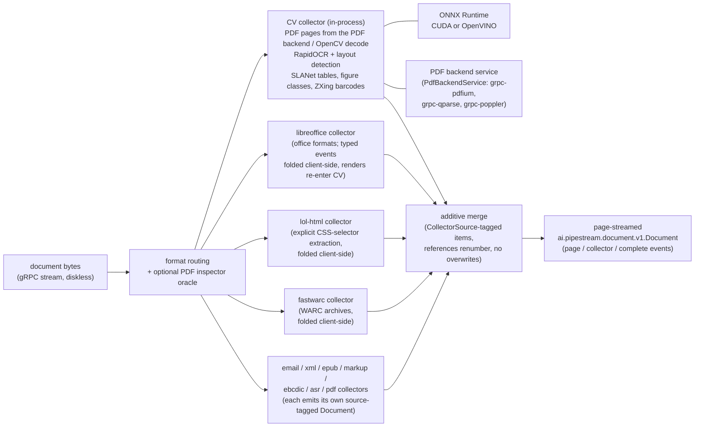
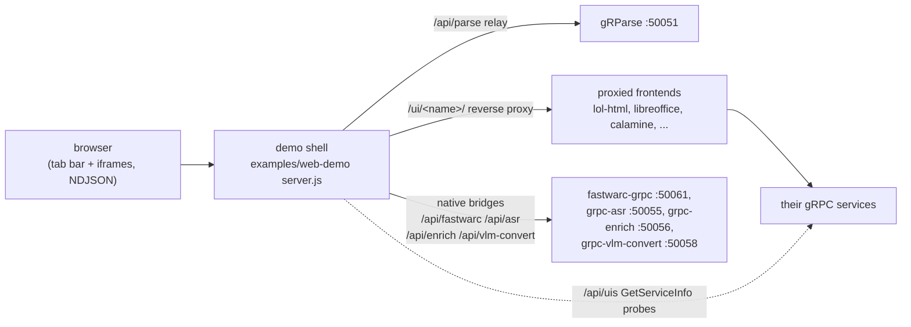
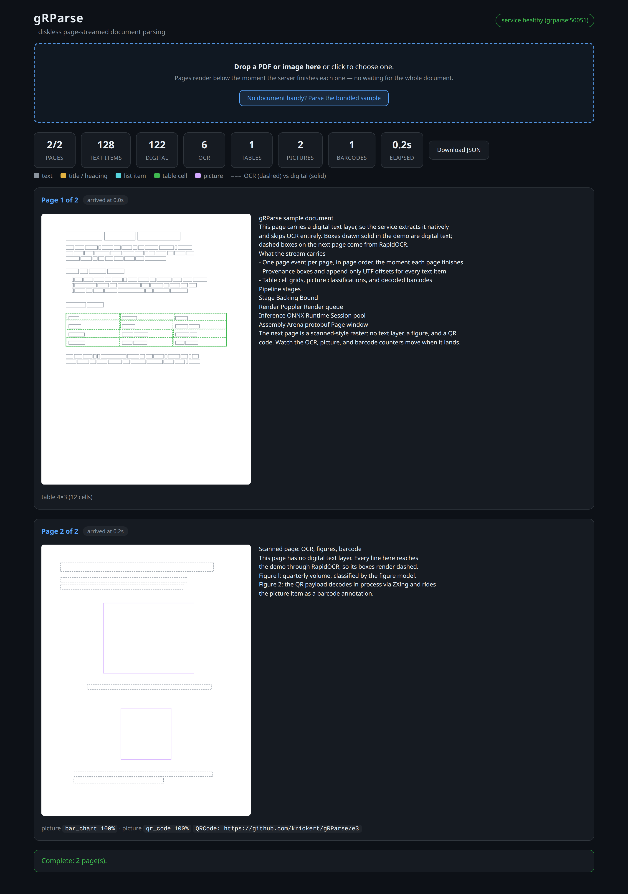

# gRParse

C++ gRPC document parse service: **diskless PDF/image to page-streamed protobuf** with boxes and stable offsets. RapidOCR and document layout detection run through **ONNX Runtime** on NVIDIA GPUs (CUDA) or Intel GPUs (OpenVINO). Layout labels, reading order, table items with model or geometry cell grids, picture items, and figure classification are live.

- Architecture (runtime split, anti-seesaw pipeline, offset contract): [docs/ARCHITECTURE.md](docs/ARCHITECTURE.md)
- Collector strategy (gRPC-first fleet, coordination, stream joining): [docs/COLLECTORS.md](docs/COLLECTORS.md)
- Epics & tasks (C++ vs Java ownership, milestones): [docs/EPICS.md](docs/EPICS.md)

**Speed thesis:** pipelined pages, warm ORT session pools, selective OCR, and early page emission keep CPU and GPU busy.

gRParse turns PDF pages and raster images into text with the maintained C++ [RapidOcrOnnx](https://github.com/RapidAI/RapidOcrOnnx) implementation. It targets NVIDIA CUDA through ONNX Runtime. The host was detected with an NVIDIA GeForce RTX 4080 SUPER; the included container exposes it with Compose's `gpus: all` setting.

## Architecture

The parse pipeline: document bytes stream in over gRPC (nothing touches
disk), route by format — with grpc-pdf-inspector as an optional routing
oracle for PDFs — into one or more collectors, and every collector's output
merges additively into one page-streamed `Document`:


```mermaid
flowchart LR
    in["document bytes<br/>(gRPC stream, diskless)"] --> route["format routing<br/>+ optional PDF inspector oracle"]
    route --> cv["CV collector (in-process)<br/>PDF pages from the PDF backend / OpenCV decode<br/>RapidOCR + layout detection<br/>SLANet tables, figure classes, ZXing barcodes"]
    cv --- ort["ONNX Runtime<br/>CUDA or OpenVINO"]
    cv --- pdfb["PDF backend service<br/>(PdfBackendService: grpc-pdfium,<br/>grpc-qparse, grpc-poppler)"]
    route --> lo["libreoffice collector<br/>(office formats; typed events<br/>folded client-side, renders re-enter CV)"]
    route --> lol["lol-html collector<br/>(explicit CSS-selector extraction,<br/>folded client-side)"]
    route --> fw["fastwarc collector<br/>(WARC archives,<br/>folded client-side)"]
    route --> rest["email / xml / epub / markup /<br/>ebcdic / asr / pdf collectors<br/>(each emits its own source-tagged Document)"]
    cv --> merge["additive merge<br/>(CollectorSource-tagged items,<br/>references renumber, no overwrites)"]
    lo --> merge
    lol --> merge
    fw --> merge
    rest --> merge
    merge --> out["page-streamed<br/>ai.pipestream.document.v1.Document<br/>(page / collector / complete events)"]
```

The demo shell (`examples/web-demo`) fronts the whole grpc-services family:
registered frontends proxy under `/ui/<name>/`, and headless services get
native tabs bridged in the shell's own server:


```mermaid
flowchart LR
    browser["browser<br/>(tab bar + iframes, NDJSON)"] --> shell["demo shell<br/>examples/web-demo server.js"]
    shell -- "/api/parse relay" --> grparse["gRParse :50051"]
    shell -- "/ui/&lt;name&gt;/ reverse proxy" --> proxied["proxied frontends<br/>lol-html, libreoffice, calamine, ..."]
    proxied --> theirs["their gRPC services"]
    shell -- "native bridges<br/>/api/fastwarc /api/asr<br/>/api/enrich /api/vlm-convert" --> native["fastwarc-grpc :50061,<br/>grpc-asr :50055, grpc-enrich :50056,<br/>grpc-vlm-convert :50058"]
    shell -. "/api/uis GetServiceInfo probes" .-> theirs
```

A one-minute screencast walks the shell end to end: the family tab bar, a
live page stream with provenance boxes, and table and figure extraction on a
real paper. [Watch it here](docs/images/demo-shell-screencast.mp4).

## Run

1. Fetch the model files: `scripts/fetch-models.sh` downloads every file in
   [models/MANIFEST](models/MANIFEST) into `models/`, sha256-checked
   ([models/README.md](models/README.md) has the per-model notes and the
   `pipestreamai/grparse-models` image alternative).
2. Build and start the service:

   ```bash
   docker compose up --build
   ```

The service listens on `localhost:50051` and implements `ai.pipestream.parse.v1.ParseService` from the local `parse.proto` contract. `ConvertSource` currently accepts one `FileSource` containing base64-encoded PDF, PNG, JPEG, or TIFF bytes. It renders every `OutputFormat` the wire declares from the merged document: TEXT, MARKDOWN, HTML, HTML_SPLIT_PAGE, JSON, CANONICAL_JSON, GDOCS_JSON, YAML, DOCTAGS, DOCLANG, DCLX (the DocLang archive), VTT, and LATEX (an empty `to_formats` keeps the plain-text default alone), and returns `INVALID_ARGUMENT`, naming the offender, for populated options it does not implement and for unrenderable format values.

gRParse links no PDF engine. Every PDF is read through the PDF backend service `GRPARSE_PDF_BACKEND` names (a `PdfBackendService` target such as grpc-pdfium, which the compose stacks start; a comma list of targets runs the consensus vote across them, see [docs/pdf-backend-services.md](docs/pdf-backend-services.md)). The engines run as separate services so their licenses stay with their own containers: the default stack is Apache-2.0 throughout, and the GPL grpc-poppler is an opt-in compose profile. The client probes each document once, then addresses it by content hash for every page's text cells and raster, so render and digital-text extraction for different pages of the same document proceed in parallel. With no backend configured a PDF fails with `FAILED_PRECONDITION` naming `GRPARSE_PDF_BACKEND`, the way an unconfigured collector fails; raster input never needs a backend. Recognition is selective by default: full native-text pages skip raster OCR, while weak/partial digital layers keep their native boxes and still run OCR, and geometry merge drops overlapping OCR duplicates so headers and scan body can coexist. Two `ConvertDocumentOptions` fields override the default per request: `do_ocr = false` disables recognition entirely, so only the embedded text layer is read and a page with no text layer yields no text; `force_ocr = true` recognizes every page at full-page scope and the recognized text replaces the embedded layer. `do_ocr = false` with `force_ocr = true` is contradictory and rejected by name. Pages rasterize at 200 DPI by default; `render_scale` sets a per-request scale in multiples of 72 DPI (accepted range [1.0, 8.0], rejected outside it by name), and all digital-line geometry scales with it so downstream boxes stay consistent. Raster inputs decode with OpenCV from request memory and are already pixels, so they ignore `render_scale`. Nothing is written to disk on the hot path.

The rest of the accepted `ConvertDocumentOptions` mirror the reference converter's (docling-serve) semantics. `pipeline` accepts `STANDARD` (the default routing) and `NATIVE`, which takes the pdf collector's model-free text-layer extraction whatever the inspector classified (a warning names the pages the models would have run for), fails with `FAILED_PRECONDITION` when that extraction fails or when the input is raster, and never runs the CV models; `VLM` and `ASR` are rejected by name. `include_page_images` overrides the server's `GRPARSE_PAGE_IMAGES` default per request, attaching a level-6 PNG of each page raster to its `PageItem` (`false` suppresses the previews a server has on). `md_page_break_placeholder` and `md_compact_tables` steer the Markdown export exactly as the reference serializer's parameters do: a placeholder part between items whose first provenance moves to a later page (before a list or inline group whose first provenanced item opens a page), and tables without column padding with a bare `| - |` rule. `image_export_mode` also steers the two DocLang exports, with docling-core's per-format defaults: `DOCLANG` writes no picture source by default (`PLACEHOLDER`), the picture's existing image uri with `REFERENCED`, and that uri or else a PNG data URI cropped from the page image with `EMBEDDED`; the `DCLX` archive defaults to `REFERENCED`, storing each picture's image (its own data-URI bytes, or a crop of its page image) as `assets/image_<NNNNNN>_<sha256>.<ext>` and pointing the picture at it, stores none with `PLACEHOLDER`, and rejects `EMBEDDED` with `INVALID_ARGUMENT`; page images go under `pages/<page_no>.<ext>` in either mode. The archive is built in memory and packs deterministically (fixed timestamps, members in path order). `doclang_include_namespace` (default true, where docling-core defaults to off) declares the DocLang namespace on the root of both; false writes a bare `<doclang>` root for byte parity with docling. `do_pdf_heading_hierarchy` and `pdf_heading_hierarchy_options` tune the section-header level pass: `enabled` (off, every undecided header is level 1 and no title is elected), `use_numbering` (read `1.1`, `A.`, `IV`, `Appendix B`, and all-caps section words as depth), `use_style` (cluster measured sizes for what numbering did not decide, and elect a title by size), `max_level` (1..6), and `style_size_tolerance` (a heading founds the next depth below `1 - tolerance` of the current depth's founding size; 0.15 is the historical 85% rule). Contradictory switches (`do_pdf_heading_hierarchy` against `pdf_heading_hierarchy_options.enabled`) are rejected by name, as is any populated option the service does not implement.

A CV conversion reports its read quality on `ConvertDocumentResponse.confidence` (and `DocumentComplete.confidence` on the live stream) as the reference's `ConfidenceReport`: per axis, `ocr_score` is the mean recognizer line score over recognized lines, `layout_score` the mean layout-region score, `table_score` the mean table-structure score, and `parse_score` the consensus vote's winner score, each absent when nothing measured it; `mean_score` averages the per-page means and `low_score` the per-page minima, and both are bucketed into `QualityGrade` (`POOR < 0.5 <= FAIR < 0.8 <= GOOD < 0.9 <= EXCELLENT`). Collector failures on `errors[]` and `collector_failures[]` carry a `FailureCategory` derived from the leg's gRPC status (`TIMEOUT` for a deadline, `CAPACITY` for `RESOURCE_EXHAUSTED`, `BACKEND_FAILURE` for a collector that was unavailable or refused the input, `INTERNAL` for the rest; target delivery reports `TARGET_UNAVAILABLE`) beside the message. Each `Chunk` carries `typed_metadata` (`map<string, ScalarValue>`) beside the string `metadata`: `min_confidence` as a double, `text_source`, and the source document's `binary_hash` (uint64) and `mimetype`.

Options Docling clients populate that no leg here reads pass only at their Docling defaults, and any other value is rejected by name with `INVALID_ARGUMENT` rather than silently ignored: `ocr_lang` may name only the languages the installed PP-OCRv3 models read (`en`, `english`, `ch`, `chinese`, `zh`); `table_cell_matching = false`; `abort_on_error = true` outside the VLM pipeline (the standard path always degrades to a partial result); `ocr_preset`, `table_structure_preset`, `layout_preset`, and `picture_classification_preset` other than `default` (`rapidocr` is also accepted for OCR); a `chunking_preset` other than `default` or `hierarchical` (there is no preset catalog, and every chunking preset falls back to the hierarchical defaults); a non-empty `table_structure_custom_config` or `layout_custom_config`; any `ocr_custom_config` key other than a `lang` naming one of those languages; `vlm_pipeline_model_api` `headers` or `params`, which the VLM convert dial does not forward; and a `picture_description_api.params` name the enrich service has no typed field for. The `picture_description_api` `prompt`, `params`, and `headers` travel to grpc-enrich typed: the prompt as `EnrichOptions.picture_description_prompt`; the params `model`, `max_tokens` (or its alias `max_completion_tokens`, not both), `temperature`, `top_p`, and `seed` as `VlmGenerationParams`, each checked for its type and range; and each header as a `VlmHeader`, sent only to the request's own endpoint. A header name HTTP does not allow, one the HTTP client sets itself (`Host`, `Content-Type`, `Content-Length`, `Expect`, the hop-by-hop names), two names differing only in case, or a value holding a control character is `INVALID_ARGUMENT` naming the header; header values are never logged or put in an error. grpc-enrich sends the headers to every per-request endpoint of the job, so headers beside a chart-extraction preset that names a different endpoint, with the chart leg on, are `INVALID_ARGUMENT` naming the preset rather than sent there. `table_mode` and `pdf_backend` are accepted at every value: one table model and the deployment's own PDF backend serve them all. `document_timeout` (seconds) caps every leg of the parse, the in-process CV pipeline included, which cancels its remaining pages and fails with `DEADLINE_EXCEEDED` once it passes. A `FileSource` without a filename is named `document`, with no extension, so its bytes rather than an assumed `.pdf` decide its type and route; likewise a PDF is recognized by a `%PDF-` header in its first kilobyte before its name is consulted.

A request may not name its own remote model endpoint unless the operator
allows it, which matches docling-serve's
`DOCLING_SERVE_ENABLE_REMOTE_SERVICES`: `picture_description_api.url`
(forwarded to grpc-enrich as its VLM endpoint) and an `http(s)`
`vlm_pipeline_model_api.url` (forwarded to grpc-vlm-convert) would have a
peer call whatever address the caller chose, internal ones included, so
they are refused with `FAILED_PRECONDITION` naming
`GRPARSE_ENABLE_REMOTE_SERVICES` unless that variable is `on` (default
`off`; the startup log states it). The operator's own endpoints
(`GRPARSE_ENRICH_VLM_ENDPOINT`, `GRPARSE_VLM_CONVERT_ENDPOINT`) are
configuration, not requests, and are unaffected.

Scanned pages fed in sideways or upside down are read upright. After a
layerless page's first recognition pass the scheduler judges the read: line
boxes that are tall rather than wide vote a quarter turn, the angle
classifier flipping every line says the page is upside down, and a poor read
(mean confidence under 0.5 over at least three lines) says nothing is known.
The raster is then recognized again turned 90 and 270 degrees clockwise for a
quarter-turn vote, 180 for an upside-down one, and all three for a poor read,
each turn at most once, and the best read wins (text over none, upright over
turned, then mean confidence). When a turn wins, the turned raster replaces the
original for everything that follows, so layout regions, table and figure
crops, the page preview, the page size and every text box are in the upright
frame together, and the turn is recorded in the page's typed
`PageItem.quality.rotation_degrees` (clockwise) for a client that renders the
source itself. Pages with any digital text layer are never re-read: the source
already applied the page's own rotation. `GRPARSE_OCR_ROTATION=off` disables
the recovery; the counters are `pages_rerecognized`, `rerecognition_passes`
and the kept turns by degrees, on the stdout metrics line and in the
Prometheus exposition (`grparse_pages_rerecognized_total`,
`grparse_rerecognition_passes_total`,
`grparse_page_rotations_total{degrees="90"|"180"|"270"}`), and
`GRPARSE_DATA_LOG=on` prints one line per re-read page with what was tried
and kept.

`ConvertSource` returns the contract's `ConvertDocumentResponse`, populated with a native `Document`. Each OCR line becomes a `TextItem`, with its page and bounding box in `provenance`; pages, `TableItem`/`PictureItem` entries from layout, and the `#/body` reference graph are also populated. It deliberately leaves asynchronous jobs and remote sources unimplemented: `ConvertSourceAsync`, the chunk `*Async` RPCs, `PollTaskStatus`, `GetConvertResult`, `GetChunkResult`, `ClearConverters`, `ClearResults`, `ConvertSourceStream`, and the `Watch*` RPCs all return `UNIMPLEMENTED`.

Table exports are bounded per document, because a table's declared size and spans are untrusted. Each table's grid keeps at most 4,194,304 positions (its leading rows and columns), and all tables of one document share 8,388,608; a table built after that keeps no positions and renders empty. A spanned cell repeats at every position it covers only while the document's span budget lasts (8,388,608 extra positions and 64 MiB of repeated text); past it the cell renders once, at its first position (a Markdown cell that references another item renders empty at its later positions instead). The export responses carry no warning channel, so a truncated export is reported only by one line on the server's stderr per document.

### Chunking

`ChunkHierarchicalSource` and `ChunkHybridSource` parse the source exactly the way `ConvertSource` does and chunk the document that comes out of it. Their asynchronous and watch variants stay unimplemented.

`StreamChunks` takes either chunk request (`hierarchical` or `hybrid`) and returns the same chunks as a server stream: one `chunk` message per chunk in `chunk_index` order, then one `summary` with the chunk count, `documents`, `chunking_info` and `processing_time`. The parse and any embedding finish before the first message, so the stream saves the consumer from holding the whole chunk list in one response, not from waiting for the parse. Each chunk message is one chunk; with `include_converted_doc` the summary carries the whole `Document`, which can be as large as a unary response and can still exceed a client's default 4 MiB receive limit. Any failure, including a missing chunker, closes the stream with its status before a single message is sent.

Determinism is the point: the same input bytes produce the same chunk bytes on every machine and every run. There is no tokenizer download by default, no locale, and no defaulted budget, and every boundary rule is versioned. Each chunk carries the version it was produced under in `rules_digest`:

| Rule set | Digest | What it decides |
|---|---|---|
| hierarchical walk | `grparse-hier/2` | one chunk per item or list group in body-tree order, with the heading trail in force; a list chunk carries what its items hold (nested lists, paragraphs) |
| hybrid | `grparse-hybrid/2;tok=T;sent=sentence/1;max_tokens=N;merge_peers=B` | the walk, then peer merging under the budget, then a sentence-wise split; T is the tokenizer in force. A chunk whose heading trail alone reaches the budget goes out unsplit, with a log line |
| tokenizer (default) | `wordish/1` | one token per run of alphanumeric code points, per CJK or kana code point, and per punctuation or symbol code point; needs no files |
| tokenizer (opt-in) | `hf/1` | a real HuggingFace tokenizer.json (for example all-MiniLM-L6-v2), so the budget is measured in the embedding model's own units |
| sentences | `sentence/1` | a boundary after `.`, `!`, `?`, or `…` plus any closing quotes, when whitespace or the end follows; no abbreviation handling by design |

`ChunkHybridSource`, and `ConvertSource`'s `hybrid_chunking` with `OUTPUT_FORMAT_CHUNKS`, require `max_tokens` and return `INVALID_ARGUMENT` naming the field when it is absent; an explicit `tokenizer` must be `wordish/1` or `hf/1`. `hf/1` resolves its tokenizer.json in this order: the request's `tokenizer_path`, then `$GRPARSE_CHUNK_TOKENIZER`, then `$GRPARSE_MODELS_DIR/chunk/tokenizer.json`; a file that does not resolve and load fails the request with `INVALID_ARGUMENT` before any parsing starts. A request's `tokenizer_path` must name a regular file inside the tokenizer directory, `$GRPARSE_TOKENIZER_DIR` (default: `$GRPARSE_MODELS_DIR`, itself `/models` by default); a relative path resolves against that directory, and symlinks or `..` that lead outside it are refused. Every refusal of a request's path reads the same, whether the file is missing, outside the directory, not a regular file, or malformed, so the option cannot probe the server's filesystem. Only regular files of at most 64 MiB are read, from any source. The file's own `padding` and `truncation` settings are stripped on load (a chunking counter measures the text it is given, and the fixed-length padding some published tokenizer.json files ship would count pads), and special tokens are never added to the count. The `rules_digest` names the counter but not the resolved file, so two deployments with different tokenizer.json files chunk differently under the same digest. Both RPCs accept `use_markdown_tables` (pipe tables instead of the default `rowLabel, colLabel = value` flattening) and `include_raw_text`. `include_converted_doc` returns the parsed document alongside the chunks; without it, a parse in which some collector failed still adds one `documents` entry with `CONVERSION_STATUS_PARTIAL_SUCCESS` and the failures in `errors`, but no content. The chunk responses have no target result, so a `target` asking for delivery (anything but unset or `inbody`) is rejected with `INVALID_ARGUMENT`.

A chunk reports `start_offset` and `end_offset` as UTF-8 code point positions in the document's text stream: the plain-text export, every text item in arena order joined by a single `\n`, furniture included. Every parse path builds the offset table from the finished document, and `ConvertSource` returns it as `text_offsets` (one row per text item, in stream order), so the spans hold for office, markup, email, EPUB and fast-path PDF documents as well as CV pages. Only the CV path's rows say how the text was read (`source`), and only when that collector is the whole document. A chunk whose items have no row carries neither field rather than a guess. Rows are keyed by arena position (`#/texts/N`) and run in arena order, so an item with an empty or repeated `self_ref` still gets its own row. Offsets count Unicode code points; a UTF-16 consumer such as OpenNLP converts with `String.offsetByCodePoints`. `TextOffset` and `TextSource` live in `parse_types.proto`: wire and JSON names are unchanged from when they sat in `parse_stream.proto`, but Python code must import them from `parse_types_pb2`.

Every `Document` that `ConvertSource` and the chunk RPCs return names the parse that produced it in `parse`, the VLM pipeline included; the `StreamProcessDocument` stream does not stamp one. `producer` is the service version `GetServiceInfo` reports (`grparse-<version>-<flavor>`). `build` is a SHA-256 of the source tree taken when CMake configures, so an unbumped version still tells builds apart. `settings_digest` is a SHA-256 of the server environment that changes output: the configured collector targets, the CV model and OCR tuning variables, the image policy and `GRPARSE_REPAIR`, plus the SHA-256 of the models directory's `MANIFEST`, so swapping the models image changes it. It names those settings, not the builds of the remote collectors behind them. `options_digest` is a SHA-256 of the request's conversion options with the output-neutral fields removed first (output formats, export styling, timeouts, API headers, structure validation, chunking) along with unknown fields. An option set explicitly to the value the server would use anyway still digests apart from unset, which can only cause an unneeded re-embed, never a stale hit. Each chunk repeats the `producer` and carries a `chunk_key`: a SHA-256 over the length-prefixed source `binary_hash`, every `parse` field, the `rules_digest` and the `chunk_index`. Equal keys mean byte-identical chunk text. A vector or annotation stored under a key that a fresh chunking no longer produces is stale. Item `self_ref`s are positions (`#/texts/12`) and can shift between builds, so store derived data against `chunk_key`, not `self_ref` alone.

A chunk's `metadata` and `typed_metadata` carry `language` when every text item in it has the same one: the item's own `meta.language`, else the document's `source_meta.language`, as a BCP 47 tag in canonical case (`zh-Hant-TW`). The key is absent when the items disagree, when one has no language, or when a tag is malformed. A chunk with no text item, such as a lone table, takes the document's language. It reports what the document's fields hold, which is a source's declaration (an Office run, an HTML `lang`, a PDF's catalog `/Lang`) or a collector's detection (grpc-asr). gRParse runs no language detection itself.

#### Optional local embeddings

The two synchronous chunk RPCs accept `embedding_options.enabled=true` to attach
`Chunk.embedding` after chunking. Without that opt-in, chunk output and model
usage are unchanged. Async/watch chunk RPCs remain `UNIMPLEMENTED`, including
requests with embedding options. Embeddings live in `parse_types.proto`; the
fleet's `document.proto` is unchanged.

The supported model is `sentence-transformers/all-MiniLM-L6-v2`, FP32 revision
`826711e54e001c83835913827a843d8dd0a1def9`: 384 dimensions, attention-mask mean
pooling, L2 normalization, no text prefixes, and at most 256 tokens including
CLS/SEP. CPU uses ONNX Runtime CPU; Intel uses native OpenVINO on a GPU;
NVIDIA uses native TensorRT. All three use the same tokenizer and pooling
contract. Floating-point results can differ across runtimes; the chunk boundary
determinism guarantee above applies to the preexisting chunk fields.

Server configuration is independent of `GRPARSE_ORT_EP`:

```bash
GRPARSE_EMBEDDING_BACKEND=cpu          # off (default), cpu, openvino, tensorrt
GRPARSE_EMBEDDING_MODEL_DIR=/models/embeddings # default: $GRPARSE_MODELS_DIR/embeddings
GRPARSE_EMBEDDING_DEVICE=GPU           # OpenVINO: GPU or GPU.<index>
GRPARSE_EMBEDDING_GPU_INDEX=0          # TensorRT GPU ordinal
GRPARSE_EMBEDDING_BATCH_SIZE=32        # capped by the loaded engine's limit
GRPARSE_EMBEDDING_BATCH_BYTES=1048576  # UTF-8 input bytes per batch
GRPARSE_EMBEDDING_RESPONSE_BYTES=67108864 # sum of serialized embedding messages
```

Explicit backend selection fails startup if the backend or verified model files
are unavailable; there is no backend fallback. `GetServiceInfo.embeddings`
reports the loaded model and effective bounds, and is absent when disabled.
Requests may assert `embedding_options.model_id` and choose a smaller positive
`batch_size`. `text_mode=EMBEDDING_TEXT_MODE_TEXT` (also the default) embeds
`Chunk.text` verbatim. `EMBEDDING_TEXT_MODE_CONTEXTUALIZED` prepends each heading
followed by a newline. Every result carries that exact tokenizer input as
`embedded_text`, plus the artifact revision, backend, dimensions and pooling
identity. Other options alongside `enabled=false` are rejected.

Invalid options fail before parsing. Oversized tokenized input fails with
`INVALID_ARGUMENT`, never truncation; byte-budget exhaustion returns
`RESOURCE_EXHAUSTED`. Requesting embeddings on a disabled server returns
`FAILED_PRECONDITION`. Batches run in order, check cancellation before and
after inference, and attach no embeddings unless every batch succeeds. Native
device calls may finish before cancellation can be observed; their results are
discarded when the request is cancelled. Inference failures fail the RPC rather
than returning an apparently complete set of partially embedded chunks.

For token-aware chunking, select hybrid `tokenizer="hf/1"`, point
`tokenizer_path` at the same pinned embedding `tokenizer.json`, and use
`max_tokens=254` to reserve CLS/SEP. The chunk counter includes headings and
excludes special tokens. It is guidance rather than an acceptance guarantee:
unsplittable content or an oversized heading trail can still exceed the model
limit, which the embedding tokenizer checks independently.

The `Health` RPC reports readiness. The server intentionally fails at startup if a required model is absent or the OCR sessions cannot initialize on the configured provider, instead of silently running CPU OCR. The optional layout, table, and figure models are the one exception: a provider that will not build one of those graphs costs that model its acceleration, not the whole server, and the session is rebuilt on CPU with the provider's own error logged. The `GetServiceInfo` RPC reports the service name, build version, and the shared-shell UI advertisement (`UiInfo`: tab title, mount path, tooltip).

To stream a PDF with the supplied client, start the service and run:

```bash
docker compose up -d
./scripts/parse_pdf.sh /path/to/document.pdf
```

The helper invokes the compiled bidirectional-streaming client. It reads the
source and sends fixed-size chunks directly to gRPC; it does not base64-encode
the document or create temporary files.

### Result targets

`ConvertSource` takes an optional `Target` naming where the result goes besides the response body. Targets are additive delivery, never a replacement: a response that carries a `target_result` still carries its full `DocumentResponse`.

| Target | What it does |
|---|---|
| `inbody` (or unset) | the default: the response body alone |
| `zip` | returns the result bundle as a ZIP in `TargetResult.archive` |
| `s3` | writes the same bundle to an S3-compatible store and returns one `StoredObject` (key, ETag, size) per member |
| `put`, `presigned_url` | `UNIMPLEMENTED`, named in the status message |

The bundle is one canonical file set, identical whichever target delivers it:

| Member | Contents |
|---|---|
| `manifest.json` | every other member with its SHA-256 and byte size, plus the generator and schema version |
| `document.pb` | the `Document`, deterministically serialized |
| `document.json` | the canonical JSON dialect of the same document |
| `exports/<name>.<ext>` | one file per output format the request asked for |
| `pages/page_NNNN.png` | each page image the document embeds |
| `pictures/pic_NNNN.png` | each picture image the document embeds |

Determinism is the point here too: members are sorted by path, archive timestamps are fixed at the MS-DOS epoch, the compressor is held to one setting, and the manifest carries no whitespace, no clock, and sorted keys. The same document and the same requested formats produce a byte-identical archive on every machine and every run.

`S3Target` signs each PUT with AWS Signature V4 over libcurl; path style, no SDK, no ambient credential chain by default. The credentials come from the request, are never logged, and never appear in an error message. A request that omits both keys is rejected unless the deployment sets `GRPARSE_S3_AMBIENT_CREDENTIALS=1`; only then do the server's own `AWS_ACCESS_KEY_ID`/`AWS_SECRET_ACCESS_KEY` (and `AWS_SESSION_TOKEN`) sign for the caller's bucket, and only on an endpoint listed in `GRPARSE_S3_AMBIENT_ENDPOINTS` (comma-separated `host[:port]`, a scheme is allowed and ignored; unset lists none), so enable it only where every caller may write wherever that identity can on those endpoints. A session token is never sent over `http://` or with `verify_ssl: false`, and ambient credentials are never used over `http://`, with `verify_ssl: false`, or for an unlisted endpoint: such a target is refused as `INVALID_ARGUMENT`. An endpoint carrying userinfo, whitespace or a control character is refused the same way. `endpoint` may name any S3-compatible store (with or without a scheme, defaulting to https), and the region is read from the endpoint host (`s3.<region>`, `s3-<region>`, past a `dualstack` or `fips` qualifier) or defaults to `us-east-1`; `region` on the target overrides both. TLS peer and hostname verification is ON unless the request explicitly sets `verify_ssl: false` for a self-signed internal store; an absent field means verify. Uploads run on their own pool, sized by `GRPARSE_UPLOAD_WORKERS` (default 4) and `GRPARSE_UPLOAD_QUEUE` (default 32). A store that refuses an upload does not cost the caller the conversion: the response keeps its full `DocumentResponse`, the failure lands as an error item, the objects already written before the refusal are still listed in `target_result.objects` so the caller can clean up or retry, and the status reports partial success; only a misconfigured target itself (missing bucket, unusable endpoint) fails the RPC, as `INVALID_ARGUMENT`.

Security posture: the target's endpoint and credentials are caller-supplied, which makes `ConvertSource` an egress writer to wherever the caller points it. That is the intended shape for the trusted-internal deployments this server assumes (the same trust the request's source URLs already get); an internet-facing deployment must put an endpoint policy in front of this RPC or keep the target surface disabled.

### Examples: browser demo and other-language clients

[`examples/`](examples/README.md) holds working consumers of the streaming
contract: a browser demo that paints each page event live (boxes, reading-order
text, tables, picture classes, barcodes) plus terminal clients in Python and
Go. The demo runs with the service in one command:

```bash
docker compose --profile demo up --build   # service on :50051, demo on :8080
```

The page ships a bundled two-page sample (digital text + table on page 1, a
scanned-style OCR page with a classified figure and a decodable QR code on
page 2), so one click exercises every feature with no document at hand, and
the full parse result downloads as JSON when the stream completes:



### Runtime image

All three images (CUDA, CPU, OpenVINO) share one runtime-stage pattern: the
runtime stage is minimal-base compatible. It runs no package manager and no
ldconfig, ships its complete shared-library closure from the build stage
(`scripts/stage-runtime-closure.sh` walks `ldd` over the binaries and over
every library they dlopen: ONNX Runtime's providers, cuDNN, the OpenVINO
plugins, the Intel NEO compute runtime), copies the pinned fonts and the
prebuilt fontconfig cache, runs as the numeric non-root user 65532, and asks
the base only for glibc, plus the accelerator's own runtime libraries where
there is one. `LD_LIBRARY_PATH=/usr/local/lib` stands in for ldconfig. Each
Dockerfile exposes the base through a `GRPARSE_RUNTIME_IMAGE` build arg:

| Image | Build stage | Default runtime base | Base requirement |
|---|---|---|---|
| `Dockerfile` (CUDA) | `nvidia/cuda:13.3.1-devel-ubuntu26.04` | `nvidia/cuda:13.3.1-runtime-ubuntu26.04` | CUDA 13 runtime libraries, glibc >= 2.43 (ubuntu 26.04) |
| `Dockerfile.cpu` | `ubuntu:26.04` | `ubuntu:26.04` | glibc >= 2.43 |
| `Dockerfile.openvino` | `ubuntu:26.04` | `ubuntu:26.04` | x86_64, glibc >= 2.43 |

```bash
docker build --build-arg GRPARSE_RUNTIME_IMAGE=docker.io/<org>/dhi-nvidia-cuda:<tag> .
docker build -f Dockerfile.cpu --build-arg GRPARSE_RUNTIME_IMAGE=<hardened base with glibc >= 2.43> .
```

None of the defaults is a Docker Hardened Image yet, and the reason is
glibc: dhi.io publishes Debian 13 (`debian-base:trixie-debian13`, glibc
2.41) and no ubuntu or gcc image, a binary built on ubuntu 26.04 (glibc
2.43) does not load there, and building on Debian 13's own toolchain fails
because its gcc 14 libstdc++ lacks the C++23 `{:?}` format spec the sources
use. The OpenVINO image has a second blocker: Debian 13 has no Intel NEO
packages to stage the GPU compute runtime from. So all three keep a plain
distribution base by default while the runtime stages already meet the
hardened contract (no package manager, no ldconfig, non-root); a hardened
base with glibc 2.43 or newer (or a Debian 14 base once dhi.io has one)
drops in through the build arg. The CUDA image's base must also match the
build stage's CUDA major (13).

Running as 65532 means the models mount only has to be world-readable, and
anything the server is meant to write (the OpenVINO kernel cache, see
below) has to be writable by that uid. `scripts/smoke-test.sh` gates every
image on the closure resolving inside the image, the server reaching its
own `main`, and the image's user being 65532; it asks the dynamic loader
directly, so it needs no shell in the image. The compose files run the
container read-only with a tmpfs `/tmp`, all capabilities dropped, and
privilege escalation disabled.

## Page-streaming OCR

`ai.pipestream.parse.v1.ParseStreamingService/StreamProcessDocument` accepts a
stream of `DocumentChunk` messages. Send the same `document_id`, filename, and
content type with the chunks, then set `complete = true` on the last one. The
server accepts any format the collector routing does (below), up to 500 MiB;
the same service's `StreamDocument` RPC is not implemented and returns
`UNIMPLEMENTED`, whatever `parse_stream.proto` says of it. `collectors`
values validate like the unary options: an unknown value fails the stream
with `INVALID_ARGUMENT` naming it. The chunk fields
`do_ocr`, `force_ocr`, and `render_scale` carry the same recognition mode and
rasterization scale as the unary options, each resolved from the first chunk
that sets it (the same doctrine as `collectors`); an invalid value fails the
stream with `INVALID_ARGUMENT` naming the offender.

The CV pipeline emits one `DocumentStreamEvent.page` per page in page-number
order. Each other collector's finished document arrives as page events
projected from it, interleaved with the CV pages, and then whole as one
`DocumentStreamEvent.collector_document`. The stream ends with one
`DocumentStreamEvent.complete`. A page event contains the supplied
`PageItem` and the page's supplied `BaseTextItem` records. `TextOffset` carries
append-only UTF offsets, source type, and OCR confidence when available. The original
`Document` shape is unchanged: this is only a transport envelope for
incremental delivery.

Each outbound event and its nested protobuf messages are allocated in a
short-lived `google::protobuf::Arena`. The arena stays alive until the
asynchronous gRPC write completes. Protobuf Arena does not own OpenCV or ONNX Runtime buffers;
those libraries release their own in-memory buffers at the page boundary. The
server never writes input documents, rendered pages, OCR intermediates, or
results to disk. It only reads the installed binaries and OCR model files. The
server has globally bounded document, render, inference, and assembly queues.
RapidOCR inference workers never perform gRPC writes. A stream that does not
consume events stops returning page credits to the scheduler, so that document
cannot advance beyond its configured page window. Other admitted documents can
continue through the global queues, and a stalled document keeps its scheduler
state until the client's credits return or the stream ends. The reactor's
in-flight write buffer is sized from `GRPARSE_PAGE_WINDOW`, so raising the page
window raises both bounds together.

The server has two CUDA RapidOCR sessions by default. Tune concurrency and
queue memory with `GRPARSE_PAGE_WORKERS`, `GRPARSE_RENDER_WORKERS`,
`GRPARSE_ASSEMBLY_WORKERS`, `GRPARSE_DOCUMENT_QUEUE`, `GRPARSE_RENDER_QUEUE`,
`GRPARSE_INFERENCE_QUEUE`, `GRPARSE_ASSEMBLY_QUEUE`, `GRPARSE_PAGE_WINDOW`,
and `GRPARSE_MAX_ACTIVE_DOCUMENTS`. `GRPARSE_MAX_IMAGE_PIXELS` (default
200000000) caps one PNG, JPEG, or TIFF page's pixel count, checked against
the image header before decode; a multi-page TIFF reads as one page per
image. `GRPARSE_INTRA_OP_THREADS` caps how many threads
one pooled ONNX Runtime session uses inside a single operator; it defaults to
cores divided by `GRPARSE_PAGE_WORKERS`, because ONNX Runtime's own default is
every core per session and a pool of those is oversubscribed by exactly the
worker count - on a small machine that costs more than the extra worker earns.
The shared layout session is exempt and takes all cores, since there is only
one of it. Select the NVIDIA device with
`GRPARSE_CUDA_DEVICE`. `GRPARSE_ORT_EP` picks the ONNX Runtime execution
provider: `cuda` (default, fails startup if CUDA cannot initialize),
`openvino` (Intel GPU/CPU/NPU through the OpenVINO build — see below), `cpu`
(explicit CPU inference), or `auto` (prefers CUDA, then OpenVINO, then CPU,
logging each fallback). Requesting a provider the linked ONNX Runtime does not
offer fails with the list that is actually available. An OCR session that
throws during inference is destroyed and rebuilt on next use instead of
staying in the pool poisoned. Optional RapidOCR detect knobs:
`GRPARSE_OCR_PADDING`, `GRPARSE_OCR_MAX_SIDE`, `GRPARSE_OCR_BOX_SCORE`,
`GRPARSE_OCR_BOX_THRESH`, `GRPARSE_OCR_UNCLIP`. These are read and range-checked
once at startup: a malformed or out-of-range value fails the server immediately
rather than being silently ignored per page. gRPC memory, thread,
and stream limits use `GRPARSE_GRPC_MEMORY_MIB`, `GRPARSE_GRPC_MAX_THREADS`,
and `GRPARSE_MAX_CONCURRENT_STREAMS`. Those bound transport buffers and calls,
not the documents behind them, so `GRPARSE_MAX_INFLIGHT_BYTES` (default 4 GiB,
printed at startup) caps the document bytes every parse holds at once across
the process: a unary call is charged on admission for its request message
plus the copy its base64 source decodes to (the chunk RPCs also for the
sources they copy into the parse), a stream each chunk as it arrives, and a
call that would pass the cap is refused with `RESOURCE_EXHAUSTED`. The merged
Document a parse builds is not charged.

A unary call returns the whole conversion in one message: the Document, every
requested export and the chunks. `GRPARSE_MAX_RESPONSE_BYTES` (default 520 MiB,
the size the server accepts itself, printed at startup) caps that message; a
conversion whose response would be larger is refused with `RESOURCE_EXHAUSTED`
naming both sizes, once the parse is complete and before anything is sent,
and the status points at `StreamProcessDocument`, which delivers the same
conversion as a sequence of messages. A 20 MB CSV once produced a 770 MB
unary response, which no client could receive.

Every RPC is served on gRPC's callback API. A unary conversion blocks for as
long as the document takes, so it never runs on the thread that reacted to the
call: it is handed to a pool sized by `GRPARSE_UNARY_WORKERS` (default 16) and
finished from there, which is what keeps a slow parse from pinning an
event-manager thread. `GRPARSE_UNARY_QUEUE` (default 64) bounds the conversions
waiting for a free worker; past it a conversion is refused with
`RESOURCE_EXHAUSTED` rather than queued behind its own deadline. A worker
spends nearly all its life waiting on the page scheduler or on a collector, so
both numbers bound concurrent conversions rather than CPU use.

When the layout model is present (see
[models/README.md](models/README.md)), every page also runs layout detection
on the configured execution provider. `GRPARSE_LAYOUT_MODEL=heron|picodet`
picks the detector: `heron` (the default, `models/layout_heron.onnx`) predicts
seventeen labels, `picodet` (`models/layout_publaynet.onnx`) the legacy five.
Both decoders are compiled in; the choice is made once at startup.

Text lines inside a labelled region take that region's label, so headings,
list items, captions, footnotes, formulas, code, document indexes,
checkboxes, forms, and key-value regions all reach the `Document` with their
own `DocItemLabel` instead of collapsing into plain text. Running headers and
footers land on the furniture content layer under `#/furniture` rather than
in the body. Table and picture regions are additionally emitted as
`TableItem`/`PictureItem` entries with provenance boxes so downstream table
and picture extraction have crops to work from.

Text streams in reading order: a recursive XY-cut over layout regions (or the
lines themselves when no model is present) splits pages at the widest
whitespace gap, so multi-column pages read column by column instead of
interleaving rows, and UTF offsets follow that order. Control layout with
`GRPARSE_LAYOUT=auto|on|off` (`auto`, the default, enables layout when the
selected model's file exists and says so at startup; `on` fails startup if it
is missing). Full-digital pages are still rasterized when layout is active,
but continue to skip OCR.

The layout model loads once into a single ONNX Runtime session that every
inference worker shares, rather than one session per worker: `Run` is
thread-safe and the decoders hold no state between calls, so pooling only
bought another full copy of the weights.

Every `TableItem` additionally carries cell structure in `data`. When
`models/slanet_plus.onnx` is present (`GRPARSE_TABLE_STRUCTURE=auto|on|off`,
same contract as layout), SLANet-plus runs on each detected table crop and
supplies the real grid: cell spans, `<thead>` rows as `column_header`, and
model cell boxes, with text lines bound to cells by box center. Without the
model, a geometry fallback clusters the table's text lines into row bands by
vertical overlap and columns by merging horizontal spans (a gap wider than
about half the median line height counts as a column gutter) with unit spans
and no header flags. Both paths give `num_rows`/`num_cols`, a rectangular
`grid`, and per-cell text with bounding boxes. Table interior text still
streams as ordinary `TEXT` items too, so UTF offsets stay contiguous for
clients that ignore tables.

When `models/figure_classifier.onnx` is present (`GRPARSE_FIGURE_CLASSES`,
same auto/on/off contract), each picture crop also runs the MIT-licensed
figure classifier (EfficientNet-B0, 26 classes such as bar_chart, qr_code,
signature, photograph, engineering_drawing, scatter_plot) and every
`PictureItem` carries a `classification` annotation with the full sorted
class distribution, which is what downstream policy hooks (signature routing,
barcode triggers, icon filtering) key on. The stream never blocks on
classification: it is one batch=1 device call per picture inside the
inference stage.

Barcode and QR payloads decode without any model: ZXing is compiled in.
By default (`GRPARSE_BARCODES=auto`) a picture crop is decoded when the
classifier's top class is `bar_code` or `qr_code`; `on` decodes every picture
crop (needs only layout, no classifier); `off` disables it. Each decoded
payload rides on the `PictureItem` as a `misc` annotation with
`kind: "barcode"` and a struct holding `format` (the ZXing symbology name,
for example `QRCode` or `Code128`), `value`, and `provenance`. Decoding is
pure CPU inside the inference stage, after the device calls and before the
raster is released.

With `GRPARSE_PICTURE_IMAGES=on` (default off) each picture region's pixels
are cropped from the page raster in the inference stage, PNG-encoded, and
attached to its `PictureItem` as an `image/png` data URI with the pixel
size. The crop happens after OCR and before the raster is released, so
device work is never delayed and no raster outlives its page. Leave it off
for figure-heavy corpora where embedded images would inflate every page
event; picture bounding boxes are always present either way.

With `GRPARSE_PAGE_IMAGES=on` (default off) every page event additionally
carries a downscaled PNG preview of the page raster on its `PageItem`, so
clients can paint provenance boxes over the real page (the web demo does
exactly this). The preview encodes in the inference stage under the same
rule as figure crops — after the device calls, before the raster drops —
and full-digital pages are rasterized for it even when layout is off. The
preview's pixel size rides its `ImageRef`; the page size stays in the
page's own coordinate space (PDF points for digital pages), same aspect
ratio.

## Collector scatter-gather

gRParse is the coordinator of a set of parser collectors. Two of them parse
in process and need no configuration at all: the CV path above
(`COLLECTOR_GRPARSE_CV`) and the wiki storage handler
(`COLLECTOR_CONFLUENCE`). The rest are remote services, each configured with
a `GRPARSE_<NAME>_TARGET=<host:port>` environment variable and left
unconfigured otherwise:

| Collector | Target env | Routed by default for |
|---|---|---|
| `COLLECTOR_LIBREOFFICE` | `GRPARSE_LIBREOFFICE_TARGET` | office formats (doc/x, xls/x, ppt/x, odf, rtf, csv, ...). The only collector for word processing and presentation formats: when its leg fails, the request fails with that leg's status (unary) or ends the stream with it (streaming), the message naming `libreoffice` and the cause. Workbooks keep the calamine leg below as a fallback body |
| `COLLECTOR_CALAMINE` | `GRPARSE_CALAMINE_TARGET` | never the routed default; a routed workbook plan (xls/xlsx/xlsm/xlsb/ods, never CSV) fans a calamine leg out beside libreoffice when configured. The wire is handle-based (`OpenWorkbook`/`StreamWorksheetRange`/`CloseWorkbook`); each sheet folds client-side into a sheet group holding one `TableItem` in absolute cell offsets, and the handle closes on every path |
| `COLLECTOR_ASR` | `GRPARSE_ASR_TARGET` (+ `GRPARSE_ASR_MODEL`, the whisper model name, required) | audio and video |
| `COLLECTOR_EMAIL` | `GRPARSE_EMAIL_TARGET` (+ `GRPARSE_MARKUP_TARGET` for HTML bodies) | `.eml`, `.msg`, `message/rfc822`. The email fold maps `text/plain` bodies only; for a message with no plain body gRParse dials the markup collector with each HTML body part and folds its items into the message body ahead of the attachment list. Without a markup target such a message has no body text and a warning names the variable. Attachments are listed by name; their content is not parsed |
| `COLLECTOR_XML` | `GRPARSE_XML_TARGET` | `.xml`, `.nxml`, `.xbrl`, `application/xml`, `text/xml` (never the `+xml` suffix family), plus the archive forms `.dclx` and `.tar.gz` (METS/GBS) |
| `COLLECTOR_EBCDIC` | `GRPARSE_EBCDIC_TARGET` | never routed; explicit selection with `ConvertDocumentOptions.ebcdic_layout` (the collector's typed `ai.pipestream.ebcdic.v1.EbcdicLayout`) only. The deprecated `ebcdic_layout_json` still works alone; setting both is `INVALID_ARGUMENT` |
| `COLLECTOR_EPUB` | `GRPARSE_EPUB_TARGET` (+ `GRPARSE_MARKUP_TARGET` for the chapters) | `.epub`. The epub collector returns the book's skeleton by contract (metadata, outline, one empty chapter group per spine item, pictures by `epub:<href>` reference); gRParse keeps the chapter XHTML and image bytes its stream carries, dials the markup collector once per XHTML chapter, plugs each chapter's items under its group in spine order, and inlines the images as `data:` URIs (manifest media type wins; above 16 MiB an image keeps its reference). Without a markup target the skeleton is the result and a warning names the variable |
| `COLLECTOR_MARKUP` | `GRPARSE_MARKUP_TARGET` | text markup: `.md`, `.html`/`.htm`/`.xhtml`, `.adoc`, `.tex`, `.vtt`, `.boxnote`, and `.json` (Docling JSON re-ingest); the dial carries a format hint from the filename, and the collector sniffs when none resolves |
| `COLLECTOR_LOL_HTML` | `GRPARSE_LOL_HTML_TARGET` | never routed; explicit selection with `ConvertDocumentOptions.lol_html_options` (the collector's typed `lolhtml.v1.ExtractOptions`) only. The deprecated `lol_html_options_json` (the protobuf JSON of that message) still works alone; setting both, or JSON that does not parse, is `INVALID_ARGUMENT`. Targeted CSS-selector extraction from HTML, not whole-document conversion: matches fold into a group per rule. HTML with no selection routes to `COLLECTOR_MARKUP` |
| `COLLECTOR_FASTWARC` | `GRPARSE_FASTWARC_TARGET` | `.warc`, `.warc.gz`, `.warc.zst`, `.warc.lz4`, `application/warc`. WARC archive parsing via fastwarc-grpc: records fold client-side into a group per record (metadata plus the payload when it reads as text, capped at 64 KiB); recoverable record errors become warnings and a framing error keeps the records already parsed |
| `COLLECTOR_PDF` | `GRPARSE_PDF_TARGET` | PDF, when configured (the CV path stays the default otherwise). The routing oracle for PDF: its classification decides the parse, see below |
| `COLLECTOR_CONFLUENCE` | none: in process | `application/vnd.atlassian.confluence.storage+xhtml`, `.confluence`, `.storage.xhtml`. The wiki storage dialect (XHTML plus the `ac:`/`ri:` macro layer), parsed here rather than dialed: headings, inline formatting and links, lists, tables with their spans, code and task macros, panels, and attachment pointers. A bare `.xhtml` stays with `COLLECTOR_MARKUP` |

A request selects collectors explicitly (`ConvertDocumentOptions.collectors`,
or `DocumentChunk.collectors` on the streaming RPC); an empty selection
routes by format as above, with PDF and raster inputs staying on the CV
path. No code path converts office bytes to PDF in order to parse them.
`GRPARSE_POI_TARGET` is no longer read; a deployment that still sets it gets
a one-line startup warning saying grPOIc is not used.

The libreoffice collector streams typed events that gRParse folds into a
`Document` itself, the epub collector's skeleton is completed here from its
typed chapter and resource events plus one markup leg per chapter
(`src/epub_book.cpp`), and the lol-html collector's match stream is likewise
folded client-side (its forward-only wire deliberately has no document
event); calamine folds client-side too (its contract carries no
document event), while every other remote collector projects its own typed
stream into a source-tagged `Document` server-side (their `emit_document`
option), so gRParse asks for the Document event, drains the typed events,
and merges what the collector itself attributed. The vendored wire
contracts live in `collectors/` (see its README); each collector repo owns
its contract.

Two family members are *not* collectors, whatever `compose.stack.yaml` runs
next to them: grpc-enrich and grpc-vlm-convert are dialed by the demo shell
directly and never by gRParse as collectors (enrich is dialed after the
merge for the chart derender leg when `GRPARSE_ENRICH_TARGET` names it).
grpc-calamine stopped being shell-only when its leg was wired in above; the
merge ranks `calamine` claims above libreoffice's on spreadsheets and below
gRParse's own stamp (see `document_claim_rank`). The fan-out leg reads the
same bytes as the routed libreoffice default, so beside a live primary its
body reading drops and only its document-level account merges
(`retain_claims_only` in `src/document_merge.cpp`): the merged document
carries the body once, and the leg's claims still rank. An explicit
collector selection stays verbatim, readings and all, and a fan-out leg
whose primary failed keeps its full reading, which is what keeps a workbook
parsing when libreoffice fails on it (a partial success with the
libreoffice failure listed under `collector:libreoffice`). fastwarc is
the other way round: a collector here, but
the stack leaves `GRPARSE_FASTWARC_TARGET` unset because the vendored
`fastwarc.v1` dialect is not wire-compatible with the published image; the
shell dials it itself.

The libreoffice leg is a hybrid: office text, tables, and typed content are
exact from the office core, so gRParse does not OCR office documents — but
the collector's page renders (the `PageImage` PNGs it streams anyway) run
through the same layout, figure-classification, and barcode engines the CV
path uses, sharing its session pools. Detected figures land as additional
source-tagged `PictureItem` entries with their class distributions and
decoded barcode payloads, boxes converted into the document's own
coordinate space — so a chart or QR code inside a DOCX is spotted and
decoded even though the office core cannot see it. The enrichment follows
the same knobs as the CV path: it needs the layout model, and barcode
decoding honors `GRPARSE_BARCODES`.

The pdf collector is a routing oracle rather than another source of pages.
When `GRPARSE_PDF_TARGET` is configured, a PDF that no request explicitly
routes becomes the inspector's call: gRParse streams the bytes to
grpc-pdf-inspector and reads the classification that opens its stream. A
text-based document takes the fast path — the collector's own folded
`Document` is the parse result and the in-process CV/ONNX pipeline is
skipped entirely. A scanned, image-based, or mixed document falls through
to the CV pipeline with recognition restricted to the inspector's
`pages_needing_ocr` (1-indexed, the same numbering the page scheduler
uses, so the set passes through verbatim), widened by what its extraction
pass found: the trailer's `extraction_ocr_reasons`, each page's
`needs_ocr`, and every page whose markdown came back empty although it drew
a picture or the document drew invisible text (a searchable scan's OCR
layer, which extraction leaves out). A text-based document that names any
such page, or whose fold carries no body text at all, takes the CV path
too rather than returning an empty Document: exactly those pages hit the OCR
engines, and every other page trusts its embedded text layer instead of
the per-page coverage heuristic deciding. When the inspector sets
`ocr_recommended` on its classification (images carry essential context, or
a dense newspaper layout whose reading order the text layer cannot be
trusted to keep), the answer covers the whole document: a text-based
document does not take the fast path even with no page named, and the CV
path recognizes every page in place of the embedded layer, as it does when
the trailer reports encoding issues that no page carries. Encoding issues the
inspector pinned to pages (a page's `encoding_issues`, or a
`SUSPECTED_GARBLED` reason) are those pages' alone: they are recognized in
place of their own layer, and every other page keeps its text. Explicit `do_ocr`/`force_ocr`
request options still outrank the classification. If the inspector is
unreachable or errors, the parse degrades to the unrouted CV path with the
failure noted, never to a failed parse; unconfigured, nothing changes at
all. When a request names `COLLECTOR_PDF` alongside other collectors, the
routing step does not apply and the inspector is a plain Document-emitting
leg like the rest.

On `StreamProcessDocument` the routing goes page by page. Unless the
inspector recommended OCR for the whole document, gRParse asks it for page
documents, and each page whose own verdict is clean goes to the client as
the inspector's slice of the fold the moment it is read. Only the pages
that need recognition go through the CV pipeline: pages it named or marked
`needs_ocr`, pages with a broken encoding, and blank pages the trailer shows
to be scans. The stream interleaves the two readings in page order, renaming
the inspector's items so the refs and text offsets run on without a gap or a
collision. A page the inspector never delivered goes to the CV path too. The
complete event names the pages each reading took.

Every collector's output is an `ai.pipestream.document.v1.Document` whose items carry a
`CollectorSource` tag, and the coordinator merges them additively: item
references renumber, sources never overwrite each other, and choosing a
winner among sources is a downstream concern. On the streaming RPC each
out-of-process collector's document is emitted as a `CollectorDocument`
event the moment that collector finishes, while CV page events keep
streaming; the terminal event lists any `collector_failures`. A failed
collector degrades to an error entry (unary) or a failure entry (stream)
instead of failing the parse while any collector succeeds; the parse fails
only when every selected collector fails.

Once the merge is complete, a post-merge repair pass runs on the finished
`Document` before anything renders from it (and on each collector's
`Document` before the streaming RPC projects it into page events). It is
format-agnostic and works on the model alone: a body text item whose text
repeats in the top or bottom band of enough pages, or that is nothing but a
page number, is relabelled `PAGE_HEADER` / `PAGE_FOOTER` and moved to the
furniture tree; a word a line break hyphenated is rejoined inside its item
(known compounds such as `well-known` and `re-enter` keep their hyphen, a
suspended hyphen such as `short- and long-term` keeps its own, soft hyphens
go, and inline spans move with the text); and a paragraph a page or column
break split, where the first part ends without terminal punctuation and the
next body sibling starts lowercase, is merged with its provenance appended
and every reference renumbered. The line break is a newline, or in text a
collector joined from lines (the `pdf` text layer, grparse's own OCR and
layout assembly, `vlm-convert`), also the single space the join left. Section headers, list items, captions and code are never touched; the
demotion and the merge only take direct body children, while the rejoin
visits every `TEXT` or `PARAGRAPH` item, group members included.
`GRPARSE_REPAIR=off` disables the pass at
startup, `GRPARSE_REPAIR=debug` prints one line per document it changed, and
the Prometheus exposition counts what it did under
`grparse_repair_changes_total{kind=...}`, one series per `RepairTotals`
counter (`furniture_demoted`, `hyphens_rejoined`, `paragraphs_merged`,
`titles_merged`, `heading_levels_assigned`, `body_items_reordered`,
`headings_split`, `headings_demoted`, `form_rows_split`, and the structural
`furniture_tree_migrated`, `orphans_repaired`, `list_children_wrapped`,
`empty_groups_removed` below).

The docling-core structural rules (docling-core #810,
`DoclingDocument._validate_rules`) are an opt-in check on the finished
`Document`. `ConvertDocumentOptions.structure_validation` is `OFF` when
unset, so existing output does not change; `REPORT` returns one typed
`StructureFinding` per broken rule and item (`rule`, `self_ref`,
`related_ref`, docling-core's message) on
`ConvertDocumentResponse.structure_findings`, and `ENFORCE` fails the
request with `FAILED_PRECONDITION` listing them (docling-core's
`raise_on_error`). `structure_validation_rules` narrows the check to the
named rules (a list with validation off is rejected). The rules: the
deprecated furniture tree lists children; a key-value or form item exists
(docling-core migrates both to field regions); a list group (`LIST` or
`ORDERED_LIST`) lists a child that is not a list item; a list item's parent
is not a list group; a non-root group has no children; an item's parent
does not exist, or does not list it. The two orphan rules are the parent-link
findings of `docling_integrity_errors`, read from the same walk and typed
(`include/grparse/structure_rules.h`); unlike docling-core, the list rules
check every arena item, not only those reachable from the body. Two of the
rules fire on gRParse's own default output today: the furniture demotion
and the CV assembly write the furniture tree, and the office form fold
emits a `FormItem` beside its field region. `structure_repairs` turns on
the matching repairs per request, after the repair pass and before the
check (each idempotent, counted in `RepairReport`): `migrate_furniture_tree`
moves the tree's children into the body with the furniture content layer,
a located header before the first body item of its page and a footer after
the last (docling-core puts every header before the whole body and every
footer after it, which it still does here when no body item names a page;
with the migration on, the furniture demotion and the continuation merge
look past furniture-layer body items, so the migration moves references
and nothing else); `repair_referenced_orphans` lists a caption, footnote or
reference under the floating item that names it and that it names as
parent; `wrap_list_children` wraps a list group's non-list-item child in a
new empty list item at its position (enumerated like its siblings, where
docling-core always leaves it unenumerated); `remove_empty_groups` removes
unclaimed empty groups until none is left, renumbering the arena and
sending any remaining reference into a removed group to its parent. With
`GRPARSE_REPAIR=off` a request's structural repairs still run, alone. The
streaming `DocumentChunk` carries the same three fields; `REPORT` findings
ride each `CollectorDocument`, `ENFORCE` fails the stream at the first
collector document that breaks a rule, and the CV page events carry no
tree to check. The chunk surfaces honour `ENFORCE` and the repairs; their
responses have no findings field.

The same pass owns the document's shape where the producer had only
geometry to go on. A body that came entirely from the PDF text layer is
re-ordered page by page with the XY-cut the CV path uses (columns top to
bottom then left to right, footnotes after the page body, captions right
after the float they label, furniture last). Heading levels follow the
numbering (`1`, `1.1`, `A.`, `IV`, `Appendix A`), all-caps section words sit
at depth one, unnumbered headings join the nearest size cluster, and the
first page's opening heading block becomes the `TitleItem`; run-in headings
(`4.2 CAPS WORDS Sentence...`) and checkbox or `Label: ____` rows split into
their own items with provenance cut proportionally. Pictures the office CV
enrichment detects are deduplicated against the collector's own pictures and
placed after the paragraph they sit beside, in page order, so output is
identical run to run; spreadsheets skip that enrichment. Office charts map to
one `CHART` picture with a bound `TableItem` (series as columns, categories
as row headers, typed numeric cells, a caption from the chart title), sheet
tables carry `column_header` and `row_section` marks and merged spans, an
HTML page's `<title>` is the `TITLE` item, and a deck's first title
placeholder is the title while later slide titles are section headers. The
origin mimetype is resolved from the declared type, then magic bytes and zip
entries, then the extension, with the evidence stamped on the origin.
`GRPARSE_DATA_LOG=on` prints one line per data change and
`grparse_data_changes_total` counts them; the figures the office CV
enrichment added and anchored count under
`grparse_office_cv_total{kind="pictures_added"|"pictures_anchored"}`; the
exposition also carries `process_resident_memory_bytes` and
`process_cpu_seconds_total`.

Raster charts are a different story: the CV path classifies a figure as a
`bar_chart`, `line_chart` or `pie_chart` but cannot read its numbers, and
gRParse has no VLM client of its own. The opt-in chart derender leg hands
that to grpc-enrich, the fleet's VLM face: set `GRPARSE_ENRICH_TARGET`
(unset means the leg does not exist; `GRPARSE_ENRICH_TIMEOUT_MS`, default
5000, bounds the whole leg per parse; `GRPARSE_ENRICH_VLM_ENDPOINT`
optionally overrides the enrich service's VLM per request) and, after the
merge and the repair pass, every picture with a chart verdict, inline pixels
(`GRPARSE_PICTURE_IMAGES=on` for CV crops) and no typed table yet is sent
through `EnrichService.EnrichDocument` with `do_chart_extraction`. Each
`ChartTable` that comes back is folded onto that picture as a
`tabular_chart` annotation and `meta.tabular_chart` (`created_by` = the
model) with a `GenerationSource` naming the model and endpoint; no items are
added, office charts (already bound from their live model) are never sent,
and a skip, an empty table, a timeout or an unreachable peer is a warning
on the document, never a failure. `grparse_data_changes_total` gains
`charts_derendered` and `chart_derender_skipped`. The contract is vendored
as `collectors/enrich_service.proto`; `eval/chart_derender/compare.py`
measures the derender per VLM endpoint against the chart fixtures' truth.
The scorecard corpus carries two chart fixtures for the composite
(`xlsx-charts`, `pptx-charts`, generated by `eval/scorecard/fixtures/` from
one data module, `chart_data.py`, with truth files quoting the same data),
and the scorecard's stability rule treats a derendered chart's title as
descriptive while keeping its cells in the fingerprint.

Each derendered chart can produce up to three outputs, as Docling's chart
stage does: `chart2csv` (the table above), `chart2summary` (a few sentences,
written to the picture's `meta.description`) and `chart2code` (Python that
recreates the chart, written to `meta.code`). Each output comes from its own
VLM call through grpc-enrich and carries the same attribution as the table
(`created_by` = the model, one `GenerationSource` per model and endpoint). A
failed output is a warning naming it; the chart's other outputs still land.
Which outputs run, which prompts they use (the Granite Vision special tokens
or Docling's natural-language wording) and which model and endpoint answer
come from a chart-extraction preset: the request names one with
`chart_extraction_preset` (unset or `"default"` means the server default) or,
when the server allows it, sends its own `chart_extraction_custom_config`.
The server decides what a request may use, with the same five settings
docling-serve 1.35 has:

| Variable | Default | Meaning |
|---|---|---|
| `GRPARSE_DEFAULT_CHART_EXTRACTION_PRESET` | `granite_vision_v4` | The preset an unnamed or `"default"` request gets. A custom preset of the same id wins over the built-in one. |
| `GRPARSE_ALLOWED_CHART_EXTRACTION_PRESETS` | unset (all built-ins) | Built-in presets a request may name, as a JSON array or comma-separated. Custom presets and `default` stay reachable. |
| `GRPARSE_CUSTOM_CHART_EXTRACTION_PRESETS` | unset | Admin presets as a JSON object, id to `{"model", "url", "engine_type", "chart2csv", "chart2summary", "chart2code", "use_natural_language_prompts"}`, every key optional (`chart2csv` defaults to true, `engine_type` to `api_openai`, an empty `model` leaves the endpoint on its default model, an empty `url` uses `GRPARSE_ENRICH_VLM_ENDPOINT`). Parsed at startup into typed presets; an unknown key or a preset with no output stops the process. |
| `GRPARSE_ALLOWED_CHART_EXTRACTION_ENGINES` | unset (all) | Docling engine names (`api_openai`, `api_ollama`, `transformers`, ...) a preset or custom config may use. |
| `GRPARSE_ALLOW_CUSTOM_CHART_EXTRACTION_CONFIG` | `false` | Whether a request may send `chart_extraction_custom_config`. |

The built-in `granite_vision_v4` preset is Docling's: `chart2csv` only,
special-token prompts, model `granite-vision-4.1-4b`. Rejections follow
upstream wording: a preset outside the registry is `INVALID_ARGUMENT`
(`Chart extraction preset 'x' is not allowed. Allowed presets: ...`); a
custom config while the switch is off (`Custom chart extraction
configuration is disabled by server policy.`) or an excluded engine
(`Engine 'x' is not allowed. Allowed engines: ...`) is `PERMISSION_DENIED`.
The policy is checked when the options are validated, whether or not the
enrich leg is configured. The compose stack defines a `stack_vlm` preset
with natural-language prompts and makes it the default, because the stack's
chart endpoint is a general VLM without the Granite tokens.

Whether every collector's data merged into the Document shape correctly is
checked on a whole corpus by the S3 eval (`eval/s3/`, see
[`eval/s3/README.md`](eval/s3/README.md)): every object of an S3-compatible
bucket goes through the unary parse (twice, plus once under a name with no
extension) and a battery of named shape checks, and the report groups the
results by file type and by parser type with every failure's key, check and
evidence. It reads the corpus into memory only and runs against whichever
bucket the environment names; `compose.stack.s3.yaml` adds a private RustFS
under the `s3` profile for a stack that brings its own.

The server registers standard gRPC health checking and reflection in addition
to the contract's `Health` RPC. SIGINT and SIGTERM initiate a bounded graceful
shutdown.

Every `GRPARSE_METRICS_INTERVAL_SECONDS` (default 60, `0` disables) the server
prints one pipeline metrics line to stdout: document and page counters, queue
depths, per-stage busy percentages since the previous line, OCR session pool
acquire/discard/wait totals, the orientation-recovery counters, the repair and
office CV totals, and a page-latency histogram from schedule to
delivery. Render and inference busy percentages climbing together under load
is the pipeline overlap working; one stage pegged while its neighbor idles
identifies where to add workers.

The same counters are available in Prometheus text format: set
`GRPARSE_METRICS_PORT` (default `0`, off) and scrape
`http://<host>:<port>/metrics`. Counters and gauges map one to one with the
stdout line; the latency buckets become a `grparse_page_latency_seconds`
histogram, and per-stage busy time is exported as
`grparse_stage_busy_seconds_total` next to `grparse_stage_workers`, so
`rate(grparse_stage_busy_seconds_total[1m]) / grparse_stage_workers` is the
same busy fraction the stdout line prints. The listener is a minimal
in-process HTTP endpoint (no framework); a configured port that cannot be
bound fails startup loudly. The compose file wires it to `9464`.

## CPU-only hosts (multi-arch)

`Dockerfile.cpu` builds against ONNX Runtime's plain CPU package, the only
one Microsoft publishes for both x86_64 and aarch64. It is the image for
machines with no NVIDIA or Intel accelerator, and the only gRParse image
that runs natively on arm64 (Apple Silicon under Docker Desktop included):

```bash
docker build -f Dockerfile.cpu -t grparse-cpu .
docker run --rm -v /path/to/models:/models:ro -p 50051:50051 grparse-cpu
```

The built image is published as `pipestreamai/grparse:latest-cpu`, a
manifest list of linux/amd64 and linux/arm64; each leg is built and tested
natively on its own CI runner, never under emulation, and every release adds
a `:<version>-cpu` tag beside it (see [docs/RELEASING.md](docs/RELEASING.md)).
Every published gRParse image carries provenance and SBOM attestations. The
image defaults to `GRPARSE_ORT_EP=cpu`; the `compose.stack.cpu.yaml` overlay
swaps the demo stack onto it, and `STACK_TAG=<version>` pins the whole stack
to a release.

The runtime stage is minimal-base compatible and runs as the non-root user
65532: everything the binaries load ships from the build stage, and the
base (`ubuntu:26.04` by default, `GRPARSE_RUNTIME_IMAGE` to swap it) only
has to provide glibc 2.43 or newer. See "Runtime image" above for the
pattern and for why the default is not a hardened image yet.

## Intel GPUs (OpenVINO)

`Dockerfile.openvino` builds an Intel variant with no CUDA anywhere: ONNX
Runtime 1.24.1 with the OpenVINO execution provider (OpenVINO 2025.4.1 and its
Intel GPU/CPU/NPU plugins, from Intel's prebuilt distribution) plus the NEO
OpenCL compute runtime. It targets Arc discrete cards (Battlemage/Alchemist),
integrated Xe graphics, CPUs, and NPUs:

```bash
docker build -f Dockerfile.openvino -t grparse-openvino .
docker run --rm --device /dev/dri --group-add "$(stat -c %g /dev/dri/renderD128)" \
  -v /path/to/models:/models:ro -p 50051:50051 grparse-openvino
```

The built image is published as `pipestreamai/grparse:latest-openvino`
(linux/amd64; a release adds `:<version>-openvino`). It
runs as the non-root user 65532, and the render node is `0660 root:render`
on Ubuntu hosts, so the container user needs the host's render group added
(`--group-add` with the numeric gid; a named `render` group does not exist
inside the image). The `compose.stack.openvino.yaml` overlay does this with
`GRPARSE_RENDER_GID` (default 990; set it in `.env` when
`stat -c %g /dev/dri/renderD128` differs). Without it OCR startup fails
loudly with the device error: the session build retries and then throws, and
the server refuses to boot rather than run OCR on CPU. The image
stages the NEO compute runtime, the OpenCL loader and the graphics compiler
from the build stage; its runtime base is plain `ubuntu:26.04` behind the
`GRPARSE_RUNTIME_IMAGE` build arg ("Runtime image" above says why).

Verified on an Arc B70 (Battlemage): detection/recognition/classification,
layout, and figure classification all compile and run on the GPU plugin.
One model does not: `slanet_plus.onnx` uses a dynamic-rank `While`/`Loop`
the OpenVINO plugin rejects on every device. That no longer stops the
server - the table session is rebuilt on CPU with the plugin's own error
logged, and everything else stays on OpenVINO - so no setting is needed;
`GRPARSE_TABLE_STRUCTURE=off` remains available for anyone who would rather
not pay for it on CPU at all.

The image defaults to `GRPARSE_ORT_EP=openvino` with
`GRPARSE_OPENVINO_DEVICE=GPU`; set the device to `GPU.<n>`, `CPU`, `NPU`, or
an `AUTO:`/`HETERO:` list. `GRPARSE_OPENVINO_CACHE_DIR` points the plugin at a
writable directory to keep compiled blobs in, which skips the recompile on
every session create (unset by default: the container runs read-only). Give
it room: the GPU plugin compiles a kernel set per input size, so OCR crops
and turned rasters add blobs continually (2400 files after a handful of
documents); the compose overlay uses a named volume, because a small tmpfs
fills up, and a truncated blob then makes the OpenCL loader abort. The
directory has to be writable by uid 65532: the image ships
`/var/cache/openvino` owned by that user, so a named volume mounted there
inherits the ownership on first use, while a bind mount needs
`chown 65532` on the host. The
layout session asks for single precision explicitly; the GPU plugin's default
half precision loses that detector real detections and drifts its boxes, while
the OCR, table, and classifier nets keep the plugin's own choice.

### Intermittent IGC failures and VRAM headroom

The krick-1 evidence behind the "Program build failed" crashes turned out to
be VRAM exhaustion, not a code defect: the Arc card reports 30.3 GiB, and a
co-tenant vLLM container started with `--gpu-memory-utilization=0.98` held
29,423 MiB of it (read from `/proc/<pid>/fdinfo` `drm-total-vram0`), leaving
too little for the OpenVINO GPU plugin's on-demand kernel compiles. About
half of service starts died in the JIT compiler (IGC `clBuildProgram`), and a
warm-cache container crashed the same way when a new OCR input size forced a
fresh compile. The openvino flavor therefore needs real VRAM headroom on the
host; a GPU that is full is a configuration error, and no in-process policy
makes room.

What the code does own is the failure policy. Session builds on the
OpenVINO provider retry up to three attempts with short jittered backoff,
one attempt at a time under the process-wide compile gate, and the retries
stay on the GPU. If the build still fails, the openvino flavor fails loudly:
the OCR session build throws and takes startup down with a clear error, and
no OCR model ever silently degrades to CPU. The one sanctioned CPU retreat
is the pre-decided table-structure case (`slanet_plus.onnx`, rejected by the
plugin on every device), which is logged in full and counted in
`grparse_ort_ep_fallbacks_total`; `grparse_ort_ep_build_retries_total`
counts the retried builds. A rising retry line is the earliest signal that
the host is contended.

The fatal class remains fatal: heap corruption or a `longjmp` across the
stack inside the toolchain kills the process (exit 139) with no exception to
catch. The mitigations for that class are the compile gate (concurrent JIT
compiles from a cold cache are the trigger), a kernel cache on real disk,
and VRAM headroom.

Provider selection is centralized in a small patch to the
RapidOcrOnnx session setup (`patches/rapidocr-session-ep.patch`); the server
refuses to start if a stale dependency cache produced an unpatched build, so
OCR session builds always carry the same retry-and-fail-loudly policy.

The image also includes `grparse-stream-client`, a bidirectional gRPC client
that sends a PDF in chunks and prints each page event as it arrives:

```bash
docker run --rm --network host \
  -v /path/to/document.pdf:/input/document.pdf:ro \
  --entrypoint /usr/local/bin/grparse-stream-client \
  grparse-grparse /input/document.pdf localhost:50051
```

Each `page=` line ends with `ms=`, the milliseconds since the first chunk
went out, and the `complete` line adds `upload_ms`, `first_page_ms` and
`last_page_ms`, so a run shows whether pages arrived as they were recognized
or in one burst at the end. The client deadline is ten minutes; set
`GRPARSE_STREAM_CLIENT_DEADLINE_S` for longer documents.

## End-to-end suite

`e2e/` holds a Playwright suite that drives the whole demo stack through
the nginx front door: the shell and its tabs, one corpus fixture per parser
through the Document tab, the gRParse page stream, every proxied service UI
under `/ui/<name>/`, and the status endpoints. It runs against a stack that
is already up, or as the `e2e` compose profile:

```bash
cd e2e && npm ci && E2E_BASE_URL=http://127.0.0.1:8080 npx playwright test   # existing stack
scripts/stack-e2e.sh                                                          # up -d --wait, then run --rm playwright
NO_GPU=1 scripts/stack-e2e.sh                                                 # CPU overlay; INTEL=1 for OpenVINO
```

Reports land in `e2e/out/` (HTML and JUnit). The script exits with
Playwright's exit code. Details, the fixture tables, and the known red
tests are in [`e2e/README.md`](e2e/README.md).

## Development

The container is the supported build environment. It runs Ubuntu 26.04
with CUDA 13.3.1, cuDNN 9, ONNX Runtime GPU 1.30.0 for CUDA 13, OpenCV 5.0.0,
RapidOcrOnnx 1.2.3 C++ sources, and gRPC 1.84.0. These are the newest applicable
upstream versions as of 2026-09-16. RapidOCR 3.9.2 is the current Python package
release; its C++ entry point still directs users to RapidOcrOnnx, whose newest
C++ tag is 1.2.3. The container needs an NVIDIA Container Toolkit-enabled
Docker installation. A CUDA-capable ONNX Runtime build is required for the
provider to exist; a CPU-only runtime cannot activate the GPU.

```bash
docker compose build
```

CI builds both images (CUDA and OpenVINO) and then boot-proofs each runtime
stage with `scripts/smoke-test.sh`: library closure of the shipped binaries
(asked of the dynamic loader itself, so no shell is needed in the image), a
boot-to-main check that needs no GPU and no models, and the image's user
being the non-root 65532. The publish workflow runs the same gate on every
leg (CUDA, CPU amd64, CPU arm64, OpenVINO) against the exact digest it
pushed, before any tag exists; how a release is cut, which tags appear on
Docker Hub and the Forgejo registry, and how the compose stack pins one are
in [docs/RELEASING.md](docs/RELEASING.md). With models present locally (or
`SMOKE_MODELS_DIR` naming a directory that has them),
`scripts/smoke-test.sh <image> --full` additionally boots the server on the
CPU provider and streams a fixture through the bundled client.

Every push and PR also runs a short libFuzzer window over the in-process
ingest door (OpenCV raster decode; PDFs parse in the backend service) — see
[fuzz/README.md](fuzz/README.md) for the standalone fuzz project and longer
campaigns. A weekly `sanitize.yml` workflow (also manually dispatchable)
builds the whole test battery with `-DGRPARSE_SANITIZE=address,undefined` in
the image toolchain (the `deps` stage of `Dockerfile.cpu`) under
`docker run --cap-add SYS_PTRACE`, not inside `docker build`, whose seccomp
profile breaks LeakSanitizer, and runs it leak-checked under the
`tests/lsan.supp` suppressions. The `cpu-image` CI job also fetches the
pinned models (the `grparse-models` fetch stage) and builds with
`GRPARSE_TEST_REQUIRE_MODELS=1`, so the layout, table-structure,
figure-classifier and hf/1 tokenizer goldens run on every PR instead of
skipping.

The build compiles with `-DGRPARSE_WERROR=ON` and runs the full `grparse`-labelled
CTest set: barcode decoder (QR fixture payload, stride-safe region views),
base64, document assembly (offsets, layout label mapping, region
items), geometry merge (including overflow bounds), layout engine (golden
against the reference detector; skips without the model file), office CV
enrichment (figure boxes scaled into twips, class-gated barcode decode over
mapped page renders), scheduler (page
credits, backpressure, partial digital→OCR merge, layout labelling, page
previews, turned scans re-read upright), orientation recovery (the turn
decision and its cost bound against a fake recognizer), PDF page
source (against a fake PDF backend: contract boxes to raster pixels under
`/Rotate` and CropBox offsets, the OCR-skip gate, the missing-backend
precondition, concurrent access, two-column reading order), Prometheus exporter (exact text rendering, cumulative
histogram, live loopback scrapes with the 404/405/500 doors), raster page
source (in-memory PNG/JPEG decode, BGR
normalization, decode-failure surfacing), reading order (XY-cut multi-column,
determinism), region geometry (center-containment binding, raster clipping,
zero-copy crops), resource pool, table structure (geometry grids, cell
binding, region crops), streaming/unary contract tests, and an anti-drift
battery: one collector input assembling to identical canonical JSON twice
over, geometry reading order and picture anchoring independent of the order
the collector reported items in, the repair pass reaching its fixed point in
one run and reaching the same one from any report order, and the office data
contract (one chart picture with exactly one bound data table and one
caption, sheet header marks with their merge spans intact, the mimetype
ladder stamped on the origin as typed fields with a typed claim behind them,
and no typed fact degraded into a colon-keyed custom field). Third-party dependencies register their own CTest
suites, so the label filter is what keeps `ctest` scoped to this project:

```bash
ctest --test-dir /build --output-on-failure -L grparse
```

Two CMake options exist for local work: `-DGRPARSE_WERROR=OFF` relaxes the
warning gate, and `-DGRPARSE_SANITIZE=address` (or `thread`, `undefined`, or a
comma-separated list) instruments the gRParse targets. ThreadSanitizer cannot
start under `docker build`, which does not allow disabling ASLR; build the test
binaries there and run them with
`docker run --security-opt seccomp=unconfined`. The scheduler, resource pool,
and PDF page source tests are the concurrency-carrying ones and are expected to
be ThreadSanitizer-clean. The whole `grparse` suite is AddressSanitizer- and
UndefinedBehaviorSanitizer-clean with
`LSAN_OPTIONS=suppressions=tests/lsan.supp` and
`ASAN_OPTIONS=fast_unwind_on_malloc=0` (checked locally in the sanitize.yml
setup). The suppression file covers one-time process-global allocations in
third-party code: the 14-byte allocation ONNX Runtime makes while building
its first `Ort::Env`, and the OpenSSL state curl_global_init leaves; none is
per page or per request. Each entry names the call that allocates, not a
whole library, so a leak elsewhere in ONNX Runtime (a session, a run) still
fails the sanitizer run. Under `undefined`, the tests that include protobuf's
MessageDifferencer header build without the null and nonnull checks, which
GCC otherwise rejects in abseil's constexpr code. Generated protobuf and
gRPC sources stay inside the build directory and are not committed; the
document messages live in a single canonical `document.proto`.
`parse_types.proto` imports two vendored collector contracts for the typed
rules it carries (`ebcdic_layout`, `lol_html_options`): a client that stages
the contract protos also stages `collectors/ebcdic.proto` as
`ai/pipestream/ebcdic/v1/ebcdic.proto` and `collectors/lolhtml_types.proto`
and `collectors/lolhtml_service.proto` under `lolhtml/v1/` (as
`types.proto` and `lolhtml_service.proto`), the way `examples/clients/*/generate.sh` do.
