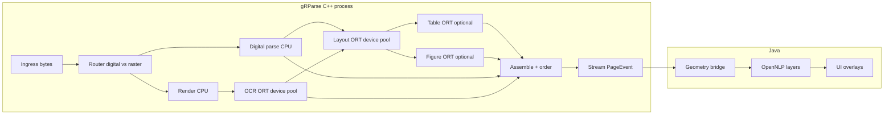

# gRParse architecture

**Status:** product freeze + epic map (tracked as GitHub issues on this repo)  
**Updated:** 2026-07-21

## Thesis

**C++/gRPC owns streaming parse, pixels, boxes, and every ONNX model.**  
**Java owns language intelligence, office bridges, pipelines, and policy.**  
**Web UI owns highlights and heatmaps from offsets + geometry.**  
**Wire shape:** JSON-compatible document contract (pages, texts, tables, pictures, body refs, provenance bboxes).

```text
ONNX + pixels + bboxes + stream parse  →  C++ gRParse (ORT EP pools: NVIDIA CUDA and/or Intel)
language / policy / office / pipelines →  Java
highlights / heatmaps                  →  Web UI (consumes offsets + boxes)
JSON document shape                    →  shared contract (MIT-shaped schema)
```

## Boundary tests

| Question | Layer |
|---|---|
| Needs page/table/picture **pixels**? | C++ |
| Needs **ONNX Runtime**? | C++ |
| Needs **bbox provenance** updated? | C++ emits; Java consumes |
| Needs **span layers** on assembled text? | Java |
| Can run with **no image**, only string? | Java |

No dual ORT stacks. No torch runtime in this service. No document CV nets in the JVM.

## Inference hardware (ONNX Runtime execution providers)

The target architecture is **ORT-first**, not CUDA-only. Sessions will bind to
the configured **Execution Provider** at process start.

Two image variants ship today: the CUDA image (`Dockerfile`, ONNX Runtime GPU)
and the Intel image (`Dockerfile.openvino`, ONNX Runtime with the OpenVINO
execution provider and its GPU/CPU/NPU plugins). `GRPARSE_ORT_EP` selects the
provider at startup from what the linked runtime actually offers, and the
server fails loudly when the requested provider is absent or cannot
initialize. Remaining B6 work is hardware qualification and pool-sizing
guidance per device.

| Target | Typical EP | Notes |
|---|---|---|
| NVIDIA GeForce (e.g. 4080 SUPER) | `CUDAExecutionProvider` (+ optional TensorRT later) | Current default path in compose/docs |
| **Intel Arc B70** (and other Intel GPUs) | **OpenVINO Execution Provider** (GPU/NPU as applicable), or ORT + oneDNN | First-class target alongside NVIDIA |
| Server CPU fallback | `CPUExecutionProvider` / OpenVINO CPU | Dev and degraded mode; still pooled warm sessions |
| Windows-only experiments | DirectML | Not required for Linux product path |

**Rules**

1. One process may ship **multiple EP builds or runtime-selected EP**, but Java still never loads document CV nets.
2. Worker pool sizing (`GRPARSE_PAGE_WORKERS`, per-model leases) is bound by **device memory of the active EP**, not a hardcoded NVIDIA assumption.
3. Model export stays ONNX opset-compatible with **both** CUDA and OpenVINO where practical; document any EP-specific ops in model tasks.
4. CI/smoke: at least one NVIDIA CUDA path and one **Intel OpenVINO (B70 or CPU skylake-avx512 class)** path as they become available.
5. Fail loud if the configured EP cannot init (same spirit as today’s CUDA fail-fast).

Env knobs:

- `GRPARSE_ORT_EP=cuda|openvino|cpu|auto` — `cuda` is the default and fails
  loud; `openvino` targets Intel devices through the OpenVINO build; `cpu` is
  an explicit choice, never a silent fallback; `auto` prefers CUDA, then
  OpenVINO, then CPU, logging each fallback. Requesting a provider the linked
  ONNX Runtime does not offer fails with the list that is available.
- `GRPARSE_OPENVINO_DEVICE=GPU|GPU.<n>|CPU|NPU|AUTO:…` — OpenVINO device
  string, passed through and validated by OpenVINO itself at startup.
- existing `GRPARSE_PAGE_WORKERS`, `GRPARSE_MODELS_DIR`


## Performance doctrine (anti-seesaw)

Do **not** serialize the machine: parse page → wait GPU → idle CPU → next stage → idle GPU.

| Principle | Mechanism |
|---|---|
| **Page pipeline** | Device ORT on page *N* while CPU parses/renders/assembles *N+1*; Java may decorate *N-1* |
| **Warm singleton sessions** | OCR, layout, table, figure ORT nets loaded once per EP; leased from pools |
| **No per-document CPU serialization** | A document's Poppler parsers are pooled (`GRPARSE_PDF_PARSERS`), so render and digital extraction of different pages of the *same* file overlap; a single large PDF must still saturate the render workers |
| **Bound by device memory / RAM** | `GRPARSE_PAGE_WORKERS` (+ per-model pool sizes); respect CUDA VRAM **or** Intel Arc memory — never unbounded fan-out |
| **Diskless hot path** | Request bytes → memory → response; office LO spill only on tmpfs if needed |
| **Selective OCR** | Digital PDF text wins; OCR only image-only / low-text pages |
| **Early stream emit** | Completed pages are emitted in document order; each arena is dropped after its asynchronous write completes |
| **Overlap Java** | Gateway annotates streamed pages while C++ still chews later pages |



Stages use separate globally bounded document, render, inference, and assembly
queues. CPU and GPU workers pull from their stage queue when free. Inference
workers release the raster and enqueue an OCR result; they never wait on a
client write. Each completed stream write returns one page credit to the
scheduler. A slow reader therefore stops only its own document at the bounded
page window instead of accumulating results or occupying an inference worker.

## Coordinate space (normative)

Every provenance box the service emits — digital PDF text and OCR alike — lives
in one shared space:

- **Origin top-left, y grows downward,** integer pixel units.
- **Scale is the 200 DPI render raster:** PDF user-space points (72 DPI) are
  multiplied by 200/72 and rounded to the nearest integer, so digital text
  boxes land on the same pixels OCR measures on the rendered page.
- **Page size is post-rotation.** A page's intrinsic `/Rotate` is applied
  before anything is reported: the advertised width/height, the raster, and
  every box already agree on the rotated orientation.
- Each `PageItem` carries its page width/height in this same space; every
  provenance `BoundingBox` is `l/t/r/b` with `r >= l`, `b >= t`, and carries
  an explicit `coord_origin = COORD_ORIGIN_TOPLEFT` — consumers should assert
  on it rather than assume.

Raster image inputs (PNG/JPEG/TIFF) use their native pixel grid unscaled —
one page whose size is the decoded image size.

## Geometry bridge contract (for Java / UI)

What a consumer of the page stream may rely on:

1. `TextOffset.utf_start/utf_end` are **Unicode codepoint offsets** into the
   assembled plain-text document, not byte offsets.
2. Text items are joined with a single `\n` in assembly order; offsets are
   **append-only across page events** — a later page never renumbers an
   earlier one.
3. `#/texts/N` refs are stable once emitted; `#/body` children reference them
   in reading order (top-to-bottom, then left-to-right by box position).
4. Every text unit carries page number + bbox in the coordinate space above,
   its source (`DIGITAL_PDF` or `OCR`), and OCR confidence when the model
   reports one; digital text has no confidence rather than a fake 1.0.
5. Page events arrive in page-number order, followed by exactly one
   `complete` event carrying the document origin and content hash.

## Offset contract (product differentiator)

Search highlights and semantic heatmaps require stable text offsets mapped to page boxes.

| Space | Producer | Use |
|---|---|---|
| Digital PDF text space | native PDF parse | born-digital words |
| Raster pixel space | render + OCR | scans |
| Provenance bbox | gRParse normalize | wire interoperability |
| Assembled document string | assemble (C++/Java) | search / NLP body |
| OpenNLP spans | Java annotators | decoration layers |
| UI overlay rects | Java/UI via geometry bridge | highlights / heatmaps |

**Rules**

1. Every searchable character maps to ≥1 provenance box (or an explicit hole).
2. Streaming pages carry stable text ids / running offsets for append-without-renumber.
3. Prefer word boxes when cheap; line boxes minimum.
4. Digital path must keep coordinates, not “string only.”
5. Heatmaps score **spans/regions**, then paint geometry — never per-pixel nets in Java.

Conceptual bridge record:

```text
TextUnit {
  ref                  // e.g. #/texts/17
  page_no
  bbox
  text
  utf_start, utf_end   // into assembled document string
  source               // DIGITAL_PDF | OCR | OFFICE_BRIDGE
  confidence?
}
```

## Office path (Java; not inside this process)

| Path | Tool | Geometry |
|---|---|---|
| Fast structured | Apache POI | text/structure only |
| Need page fidelity | Pooled LibreOffice/JODConverter → PDF bytes → gRParse gRPC | full boxes |
| Spill | `TMPDIR=tmpfs` | not durable disk |
| Later optional | same-host memfd if copies dominate | after profiling |

gRParse stays **PDF/image only**. Do not embed LibreOffice here.

## Models (all C++ ORT; CUDA and Intel OpenVINO)

| Stage | Shape | Priority |
|---|---|---|
| OCR | RapidOcrOnnx (have) | done |
| Layout OD | RT-DETR / YOLO-doc class ONNX | P0 structure |
| Table structure | SLANet/TATR-class ONNX; geometry word→cell v0 first | P1 |
| Picture class | EfficientNet-class ONNX | P2 |
| Barcode | ZXing/ZBar when class says barcode | optional |

Layout is parent: table/picture crops come from layout regions.

## C++ ownership (this repo)

- gRPC unary + streaming
- In-memory PDF/image ingest
- Digital PDF text + coordinates
- Render + selective OCR
- Layout / table / figure ONNX pools
- Assemble + reading order
- Stream page JSON with provenance
- Backpressure, limits, pipeline metrics

## Java ownership (external; tracked with `area:java` here)

- Consume page stream / final document JSON
- Geometry bridge + OpenNLP `Document` + research annotators
- POI + pooled Office→PDF escalation
- Policy on picture classes (PII, RAG filters)
- Chunk/index pipelines

Landing zones (org): OpenNLP research arm, Java gateway services, `pipestream-protos` when ready.

## UI ownership (`area:ui`)

- Page image + bbox overlays
- Lexical highlight via offsets
- Semantic heatmaps via span/region scores
- Stream-friendly paint (page N before doc complete)

Landing zone: `pipestream-frontend` (or successor UI).

## Explicit non-goals

- Torch/VLM caption stacks as default
- LibreOffice inside the OCR process
- Second ORT runtime in Java for page CV
- Universal office clone in C++
- Unbounded page fan-out

## Related docs

- [EPICS.md](EPICS.md) — epic/task map and milestone order
- [../README.md](../README.md) — run/build

## GitHub tracking

All epics/tasks: [ai-pipestream/gRParse issues](https://github.com/ai-pipestream/gRParse/issues)

| Epic | Issue | Milestone focus |
|---|---|---|
| A Chassis & provenance | #1 | M1 |
| B Pipeline runtime + multi-EP ORT | #2 | M1 (includes **B6 Intel Arc B70**) |
| C Layout ONNX | #3 | M3 |
| D Tables | #4 | M4 |
| E Pictures | #5 | M4 |
| F Office bridge | #6 | M5 |
| G Geometry + OpenNLP | #7 | M2 / M6 |
| H UI highlights/heatmaps | #8 | M2 / M6 |
| I Contract/packaging | #9 | continuous; **I1 schema low priority (gRPC toJSON)** |

Full task ID → issue number table: [EPICS.md § Issue number map](EPICS.md#issue-number-map).
